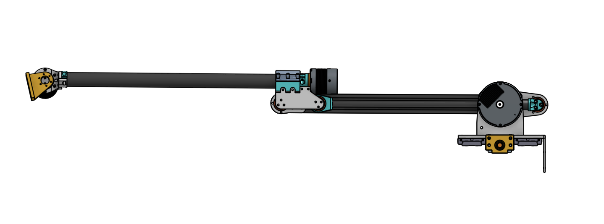
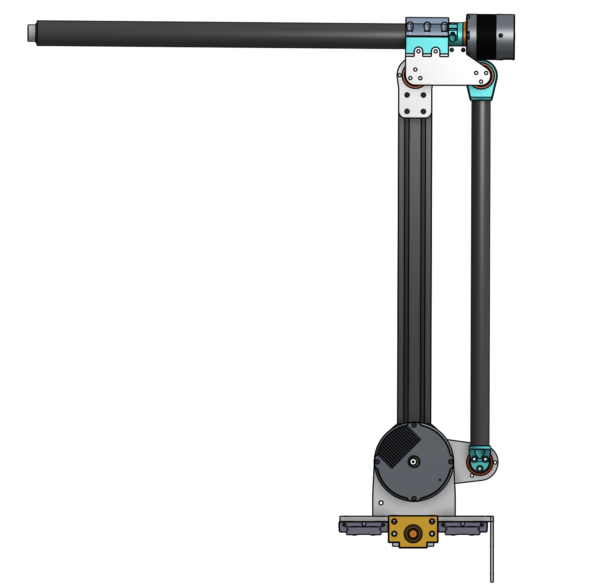
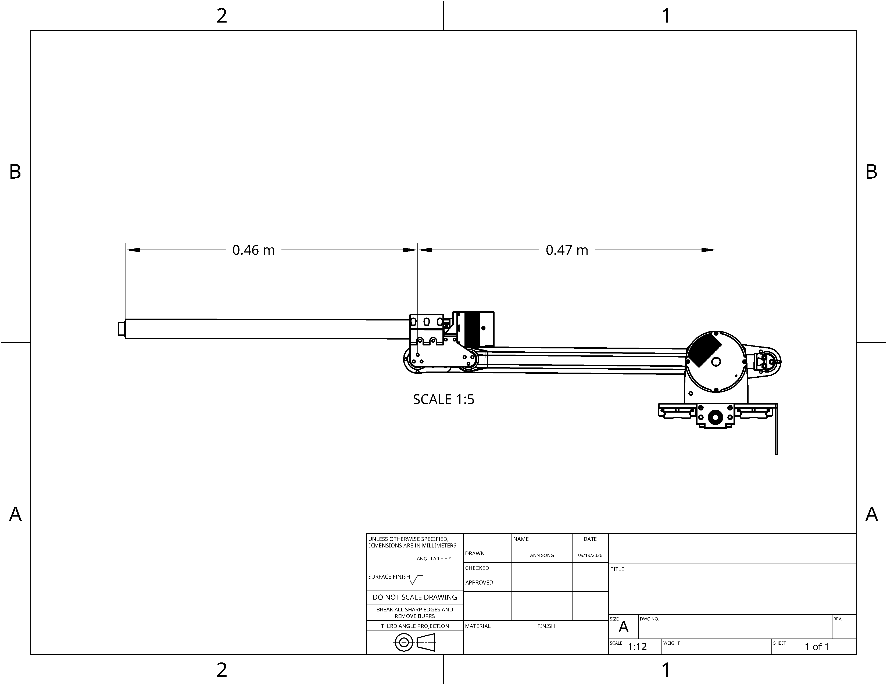
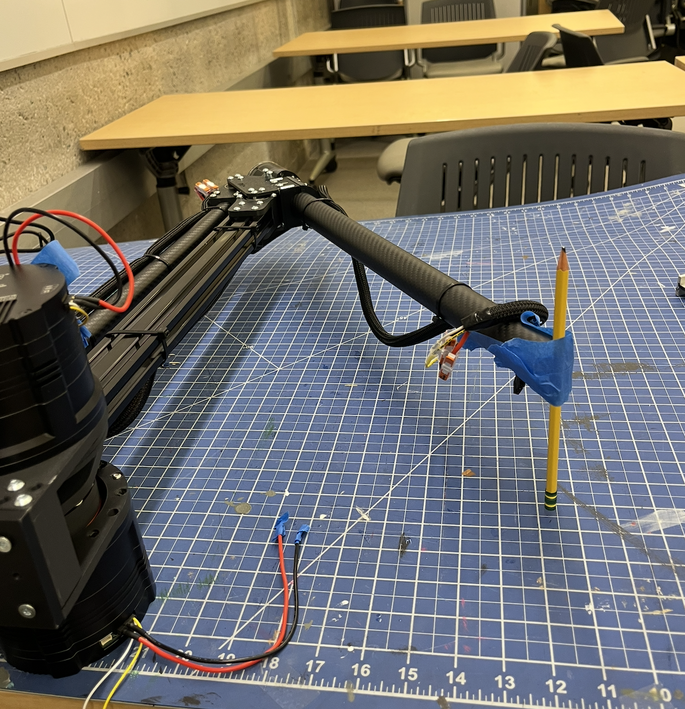

<!--
Add a new log entry with:

## Month Day, Year

Write progress notes here. Multiple paragraphs are okay.


Inline math: $x = y + z$
Greek letters and degrees need a backslash: $\theta$, $90^\circ$
Display math:
$$
x = y + z
$$

Mark an important day by adding it to the milestones section:

## Milestones
- 🚀 Month Day, Year - Short note about why it mattered

The date should match a log entry heading. The icon shown on the page comes from
data-milestone-icon in rover.html, so the emoji here is optional.
-->

## Milestones

- 🚀 September 18, 2026 - Project start

## September 19, 2026

I started the day by submitting a [PR](https://github.com/2b-t/myactuator_rmd/pull/28) to the MyActuatorSDK repo.

Early on in the day we also found a work around to the Teensy CAN issue by just not using Teensy. We found a way to get all three of the motors on the arm right now onto the same bus, so we could use the initial USB to CAN adapter that was already working.

The rest of the day was working on the kinematics of the arm.

I established a mahematical zero as a reference point:



as well as a physical startup pose the robot could start with that's more stable than the reference zero:



Physical angle definitions:

q_s = upper arm angle measured from horizontal

q_e = forearm angle measured relative to upper arm

Therefore, the forearm's angle relative to the stational base is q_s + q_e.

At the L shaped startup:

$$
q_{s} = 90^\circ
$$

$$
q_{e} = -90^\circ
$$

### First attempt
My first model just took the link lengths and plugged them into equations for the x and z coordinate.



$$
L_{1} = 0.47m
$$

$$
L_{2} = 0.67m
$$

$$
x = L_{1}cos(q_{s}) + L_{2}cos(q_{s} + q_{e})
$$

$$
z = L_{1}sin(q_{s}) + L_{2}sin(q_{s} + q_{e})
$$

The prismatic joint makes the y coordinate easy, so I didn't touch the y at all.

So with this setup I had made two assumptions that may or may not have been true lol
1. The elbow-to-wrist displacement lay entirely along the forearm’s reference direction.
2. After correcting encoder signs and zeros, motor readings equaled physical joint angles:

$$
q_{s} = \theta_{s}
$$

$$
q_{e} = \theta_{e}
$$

The second assumption meant I could send the IK elbow angle directly to the elbow motor.

### Problem with model
For testing, we clamped the robot on its side with a mat under it and taped a pencil on the end of the forearm:



When I commanded the zero position in cartesion coordinates at (0.46, 0.47) it worked fine. So I was like yay amazing and then I continued testing and it was less amazing.

I commanded:
$$
(x, z) = (0.46, 0.24)m
$$

but measured:

$$
(x, z) = (0.5235, 0.267)m
$$

6.35 cm too far outward and 2.7 cm too high. The software reported no FK error, which meant the angles calculated by IK reproduced the target when passed through my own FK equations, which tells us nothing because they were both mine.

### My realization that should've come sooner

Now because of my experience with my [Tomato Robot Arm](tomato.html), I had assumed the representations of the joints would be as simple as it was for that arm. The difference is where the joint motor is mounted. For this rover arm, the elbow motor is at the baes of the robot and drives the elbow joint through linkage transmission. Therefore, the difference between movement of the shoulder for these two arms on the elbow angle is shown below:


### New model
My new model for the joints separates motor joints from the physical joint angles. The shoulder is unchanged:

$$
q_{s} = \theta_{s}
$$

I started looking at this relationship for the elbow:

$$
q_{e} = \theta_{e} - \theta_{s} + C
$$

That means the forearm's absolute orientation is modeled by:

$$
\beta = \theta_{e} + C
$$

To summarize, this means the forearm's absolute orientation is only controlled by the elbow motor encoder with some constant offset. However, the physical elbow angle relative to the shoulder arm depends also depends on where the shoulder motor encoder is.

For example, if the shoulder rises 10 degrees while the elbow motor readings stay fixed, the model predicts

1. Forearm absolute orientation stays fixed
2. Physical elbow angle decreases 10 degrees

### Empirical tests
Because I have no intuition for motion or physics, I took 30 poses and recorded the measured wrist x and z, and the shoulder and elbow motor readings to find C. After fitting the data, kinematics was working pretty well:

Trying sideways (left) and drawing a 10cmx10cm square (right):


### Summary

There's essentially two parts:

Given an $(x, z)$ input, we first convert it to desired joint angles $(q_{s}, q_{e})$, then convert those into the motor commands $(\theta_{s}, \theta_{e})$:

$$
(x, z) \xrightarrow{\text{geometric IK}} (q_{s}, q_{e}) \xrightarrow{\text{inverse transmission}} (\theta_{s}, \theta_{e})
$$

Current transmission model:

$$
\theta_{s} = q_{s}
$$

$$
\theta_{e} = q_{e} + q_{s} - C
$$

C was derived from 30 calibration points, but it can probably be derived because the link thing is just a parallelogram. Idk we'll see.

## September 18, 2026

The subsystem I'm specifically working on right now is software for the arm. The good news is we got basic teleop working:


Mechanical isn't fully finished, but there are three motors working right now. If you notice, the video only has one motor working.

Basically, the setup we're working toward has two CAN buses. One ROS 2 project can control both, but each motor just needs to be associated with the right interface and motor ID. We have working communication through the regular USB-CAN adapter, but getting the Teensy to serve as the interface for both buses is giving us issues.

The other annoying thing is that I'm developing in an Ubuntu VM through UTM on my Mac because the onboard RPI isn't available yet. 

Also getting motor IDs configured took more work than expected. The SDK's existing `setCanId()` and `getCanId()` both use command `0x79`, with different fields to distinguish writing from reading. On our firmware, neither produced the expected response. Instead, the SDK threw exceptions such as `Unexpected response '0x9a'` or `Unexpected response '0x92'`.

After I captured the raw CAN traffic to see what was actually happening, I found out with the manufacturer's CAN protocol manual, the newer ID-setting operation uses command `0x20` and `0x79` was discontinued. So I basically had to write a patch for the MyActuator SDK with an additional `setMotorId()` implementation that used the proper command code.

Oh and then the first version of the patch had a confusing failure where basically the write would time out, but after power-cycling the motor, the new ID worked.

```text
0x142  92 00 00 00 00 00 00 00    Read angle from motor 2
0x242  92 00 00 00 ee c2 ff ff    Normal reply from motor 2
0x142  80 00 00 00 00 00 00 00    Shut down motor 2
0x242  80 00 00 00 00 00 00 00    Shutdown acknowledgement
0x142  20 05 00 00 01 00 00 00    Set motor ID to 1
0x241  20 05 00 00 01 00 00 00    Acknowledgement from the new ID
```

The motor did acknowledge the write, with an exact echo of the request. It just sent that acknowledgement from the new ID's reply address. The SDK was still listening for the old address, so it discarded a valid reply and eventually timed out.

After I fixed the patch to accept acknowledge from either old or new reply address, it was working.

The next part was replacing the adapter arrangement with a Teensy 4.1 connected to two SN65HVD230 CAN transceiver modules.

| Module | Teensy controller | Module CTX/TX connects to | Module CRX/RX connects to |
| --- | --- | --- | --- |
| Board 1 | CAN3 | Pin 31 | Pin 30 |
| Board 2 | CAN1 | Pin 22 | Pin 23 |

The Teensy didn't initially expose a native SocketCAN interface, so I wrote firmware using FlexCAN_T4 that presents two USB serial ports and implements an SLCAN bridge on each, so Linux can identify them.

Now the problem is the Teensy accepts the serial commands and queues the requests, but reports CAN errors. We repeatedly saw `F24`, meaning error warning and error-passive, and later `F80`, meaning bus-off.

After a lot of probing with a multimeter and trying to figure out how the oscilloscope worked, we've concluded it's a transceiver issue because:
- The motors communicate successfully through the regular USB-CAN adapter.
- The Teensy's CTX signal pulses at the transceiver input when we send a request.
- CAN-H and CAN-L both hover at around 1.6 V, so we're seeing activity going into the transceiver but no corresponding activity coming out lol
- We verified the module's 3.3 V supply and measured about 60 Ω between CAN-H and CAN-L with everything powered off, which is consistent with the termination we want

Erm so like idk, to be continued