<!--
Add a new log entry with:

## Month Day, Year

Write progress notes here. Multiple paragraphs are okay.


Inline math: $x = y + z$
Display math:
$$
x = y + z
$$

Mark an important day by adding it to the milestones section:

## Milestones
- 🍅 Month Day, Year - Short note about why it mattered

The date should match a log entry heading.
-->

## Milestones

- 🍅 August 28, 2026 - Harvested tomatoes in the field consistently
- 🍅 August 20, 2026 - Elevator assembled
- 🍅 July 25, 2026 - Harvested first real tomato in the field
- 🍅 June 26, 2026 - Robot arm assembled
- 🍅 June 4, 2026 - Project start

## June 04, 2026

I worked on the tomato detection side of the project. I looked into possible datasets for training and testing, which included the [Laboro tomato dataset](https://www.kaggle.com/datasets/nexuswho/laboro-tomato), [Mendeley cherry tomato images](https://data.mendeley.com/datasets/ffgp73gfsr/1), and [RoboPheno RGB images](https://research.wur.nl/en/datasets/rob2pheno-annotated-tomato-image-dataset/). I only used the Laboro for training and the other two for testing.

The Laboro dataset has six classes:

1. `b_fully_ripened`
2. `b_half_ripened`
3. `b_green`
4. `l_fully_ripened`
5. `l_half_ripened`
6. `l_green`

The `b` and `l` are for big and little.

## June 05, 2026

Since my target application is autonomous cherry tomato harvesting, I planned to train the detector on Laboro and then evaluate it on the other two sets of cherry tomato images. I also decided to use YOLOv11s for object detection because it seemed to do the best when compared to smaller and larger models in terms of balancing accuracy with latency. So the final model configuration: YOLOv11s, object detection task, 640 × 640 input resolution, six classes, and outputs of bounding box, ripeness class, and confidence score.

I decided to use bounding boxes instead of instance segmentation. Segmentation would give more precise tomato boundaries, but lowk I wasn't about to spend multiple days annotating data for segmentation because Laboro doesn't come with it. Plus  tomatoes are often occluded by leaves, stems, calyx structures, and other tomatoes. Bounding boxes are simpler and still accurate enough for deciding which tomato to harvest. If it's an issue, it's future Ann's issue idc.

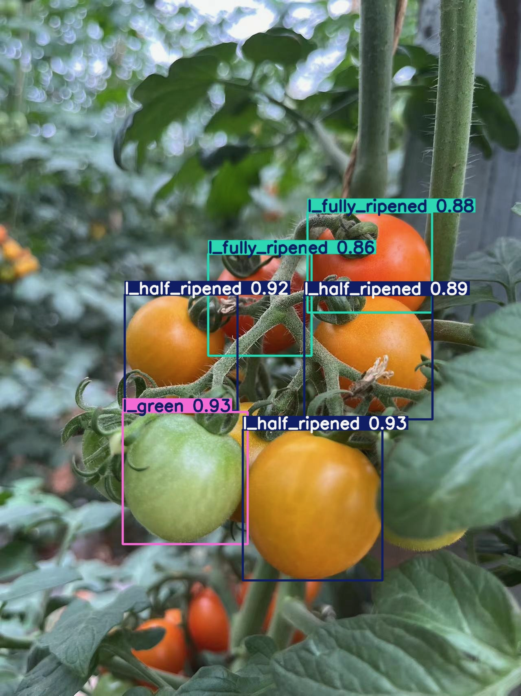
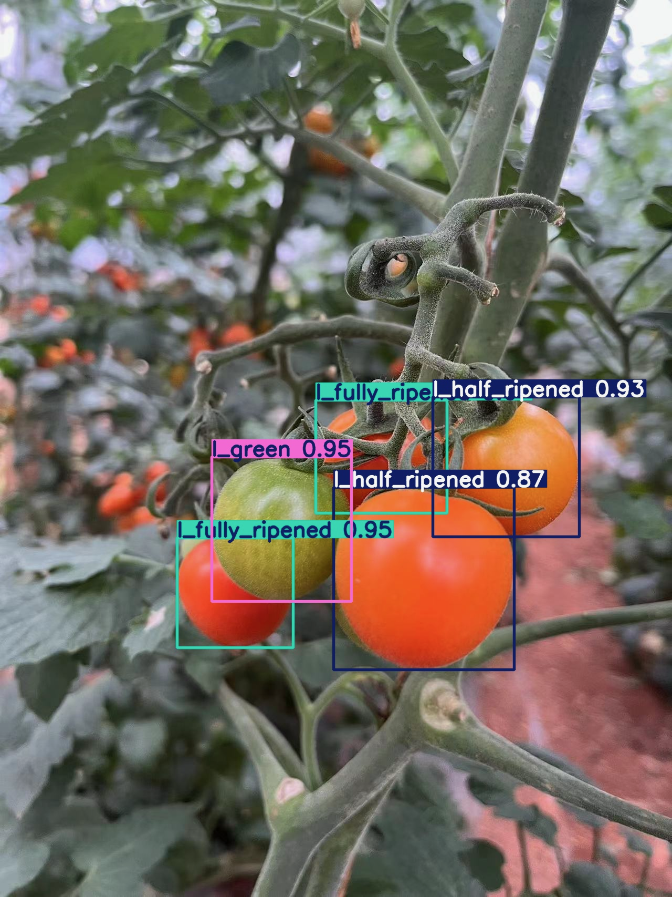
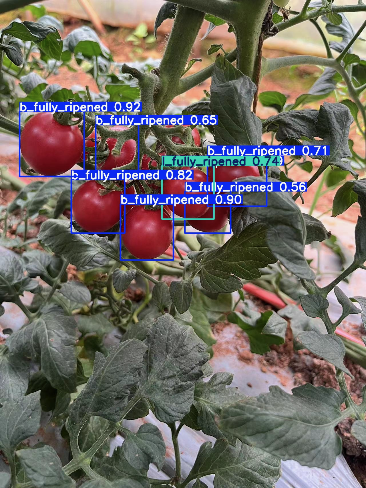

## June 06, 2026

Today I worked on connecting tomato detection to harvesting decisions. I simplified the original six Laboro classes into three ripeness categories: fully_ripened, half_ripened, and green because idrc how big tomatos are, a tomatos a tomato lol.

I also started thinking about validation after YOLO detection. Since false positives could cause the robot to harvest the wrong thing, I added the idea of filtering weak bounding boxes before using them. I have two checks: a minimum area filter and a tomato color coverage filter. Very small detections would be rejected using a minimum bounding-box area threshold of 400 pixels, since these are likely caused by image noise, stems, or background artifacts.

I also wanna do an additional check for the tomato color because I lowk don't think I trust the model fully. It's detection is great, but half ripened vs ripened is a little iffy.

For the tomato color coverage check, I planned to crop each YOLO bounding box, convert it to HSV, classify pixels as red, orange, yellow, or green, and compute:

```
tomato_ratio = tomato-colored pixels / total pixels in bounding box
```

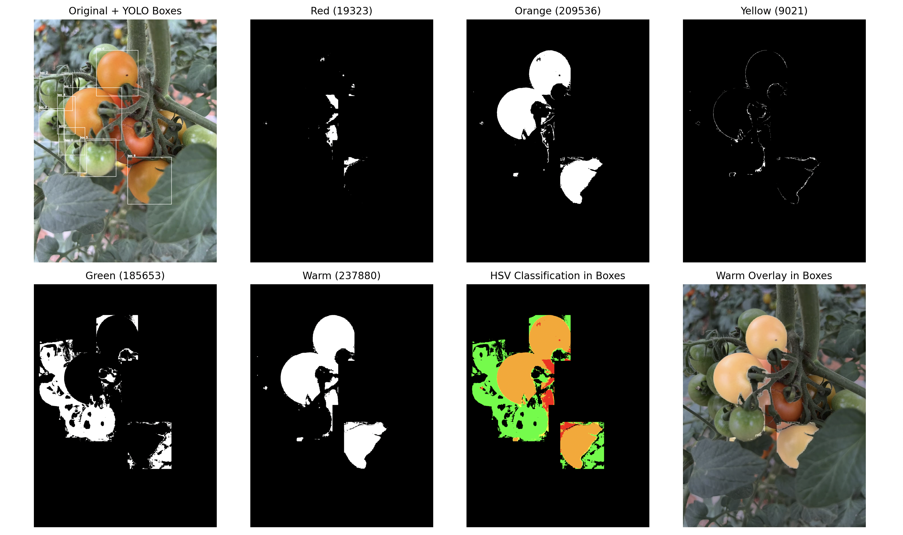
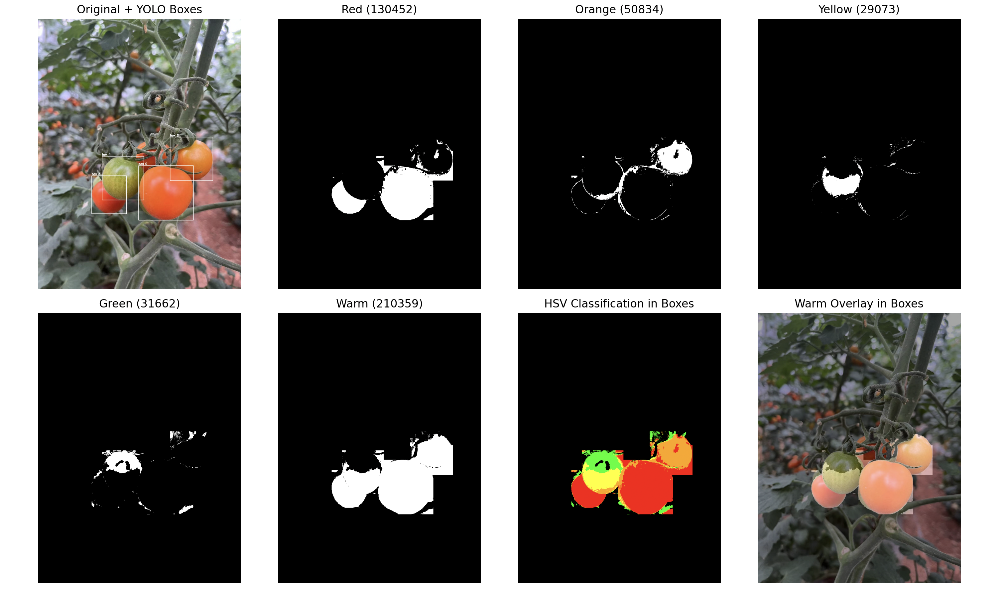
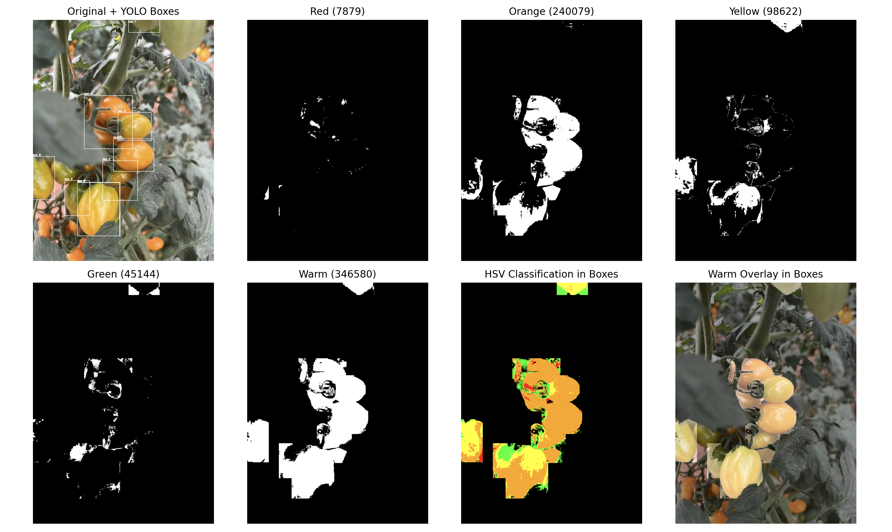

I added a minimum warm-pixel requirement so that a few red pixels would not accidentally make the system classify a tomato as ripe. I also implemented the final decision fusion between YOLO and HSV. If YOLO and HSV agreed, the decision was straightforward. A fully ripe tomato would become fully_ripened_pickable, while half-ripe and green tomatoes would become not pickable. If YOLO and HSV disagreed, the system would act conservatively. For example, YOLO fully ripe but HSV half ripe would be treated as half_ripened_not_pickable.

After finalizing the harvesting policy for the tomato detection pipeline, the system would produce one of four final decisions:

- fully_ripened_pickable
- half_ripened_not_pickable
- green_not_pickable
- uncertain_not_pickable

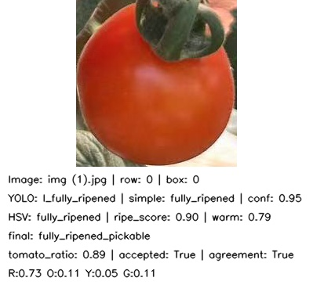
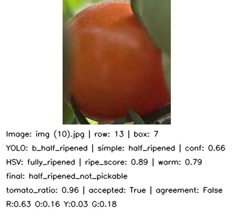
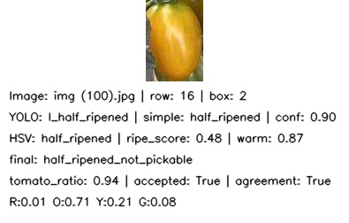
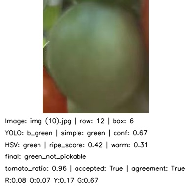

Only ```fully_ripened_pickable``` tomatoes would be considered valid harvesting targets. Everything else would be excluded from autonomous harvesting.

In general, the main design philosophy was to prioritize precision over recall. Harvesting an unripe tomato is irreversible, while missing a ripe tomato only delays harvesting until a later pass. Because of that, the system is quite conservative with deeming a tomato as pickable.

## June 07, 2026

So today I lowk had the realization that plain Python might not cut it for this project. I think I wanna try using ROS for this project, so I did a little research on the basics of ROS because I've never used it. Just did some reading of documentation on Nodes, Interfaces, Topics, Services, Actions, etc. It seems pretty intuitive. Like it seems like ROS nodes are just somewhere in between classes and subsystems.

## June 09, 2026

I went back to the perception pipeline today and worked on camera calibration. Originally we were gonna use an RGBD camera but those types of cameras are just slightlyyyyy way too expensive, so instead I'm going to build stereo vision with two Raspberry Pi Cameras.

The extent of my knowledge of cameras is from FRC limelight cameras, so this involved watching a lot of yt videos to teach myself calibration and how stereo vision works in general. I got monocular calibration working (I think?) with OpenCV. Image rectification is also working.

Here is my very scuffed camera mount.
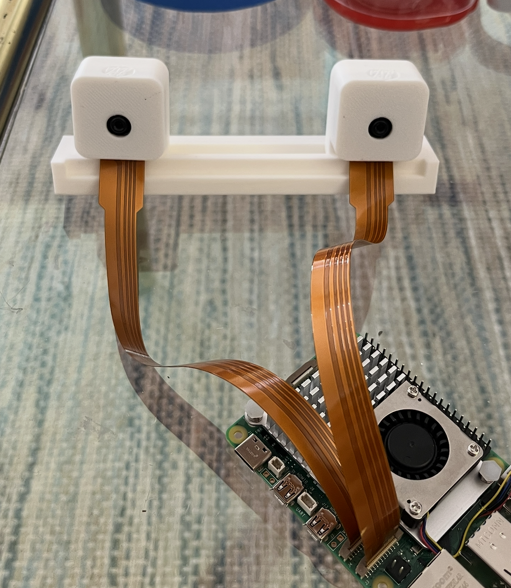

## June 10, 2026

I did research on Semi-Global Matching (SGBM) today. It's supposedly more effective than regular Block Matching as a stereo matching algorithm. I first started by reading the [original paper](https://ieeexplore.ieee.org/abstract/document/1467526) for SGBM. It made no sense lol. But after reading some other articles and papers it made a little more sense!

## June 11, 2026

Ok so image rectification is actually really bad lol. Like really bad. Nothing aligns on the same horizontal line, so I don't think I should even attempt SGBM right now. I think something with my camera mount is causing issues because the weird thing with the mount is that if you close cover so it's snug, it puts pressure on the cameras where there shouldn't be pressure and it causes the feed to be really blurry.


## June 13, 2026
The first servo motor arrived. We are planning on using the STS3215 model.
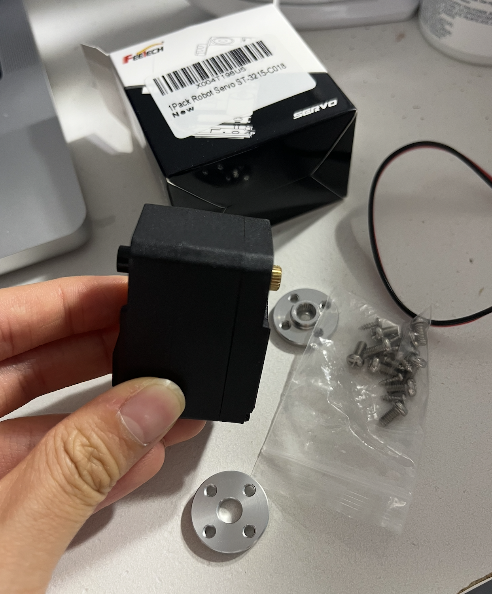


## June 15, 2026

I attempted running the motor with some pre-written code today. Uh so it didn't work. We actually think I mayyy have fried the motors. They're only able to move in really small incremeents idk. TBD, but I ordered another servo and I'm gonna keep my distance for now lol.

## June 20, 2026
So I actually didn'y fry the servo, I was just being dumb and didn't realize the encoder reads ticks. Since it's a 12 bit encoder, there's 4096 ticks in a revolution. After writing some conversion constants and reading some documentation on the different modes of the servo, I was able to get it to spin at a set velocity. I think next steps are getting it all implemented as ROS nodes.

## June 21, 2026
I worked a lot on the motor node today. Named it FeetechMotorNode and it'll basically be the node for the entire motor bus. The node is a publisher to ```joint_states``` where it just publishes the angle of the motors. It's also a subscripted to ```motor_target_velocities``` which in the future, other nodes will send velocities for the motor node to set the motor to. From a design standpoint, I want this to be the only node directly communicating with the hardware.

## June 22, 2026
I wrote the camera node today. The left and right camera will use the same node just with different parameters. It takes in camera_id, width, height, topic, and fps as of right now. It publishes raw images right now.

I also figured out what launch files do, so I wrote a launch file to launch the only two nodes I have right now lol.

## June 23, 2026
The robot arm design was completed today!

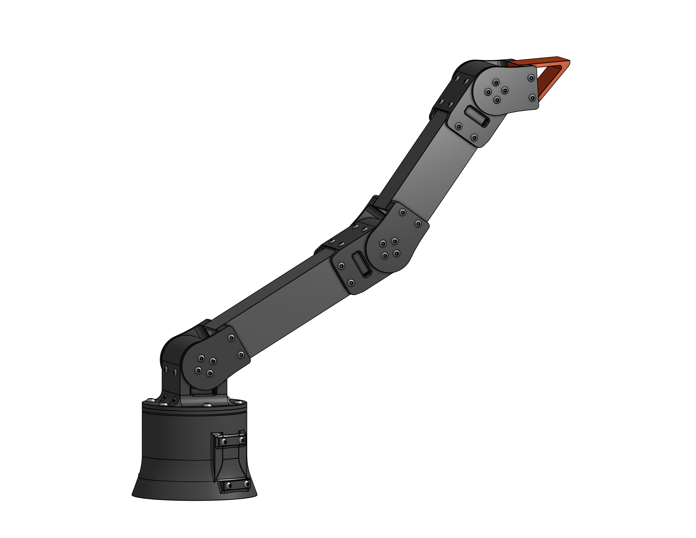
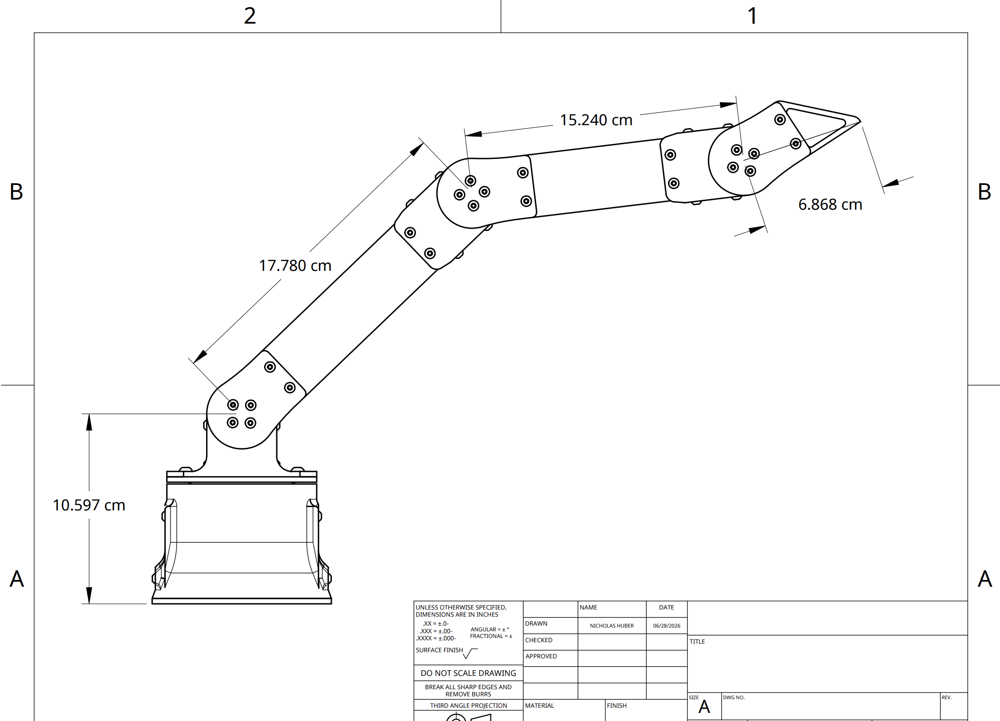

I also set up a perception package today with one node named TomatoDetection that subscribes to the topic where the camera node publishes raw images (I haven't decided the topic names yet), publishes to ```/tomato_seen (Bool)```, ```/tomato_crop_image_raw (Image)```, and ```/tomato_yolo_ripeness```.

## June 24, 2026
Ok I switched up the design of the TomatoDetection Node. I added custom interface messages for detections, so I'm able to publish multiple tomatos that are detected. It only publishes to ```/tomato_detections``` now. The custom message basically has information on yolo ripeness and confidence and coordinates on where the tomato is in the raw image.

I got the three nodes communicating with each other. It doesn't look like much, but getting the publishers and subscriptions communicating properly was lowk non-trivial. Turn sound up for video.


## June 25, 2026
I wanted to get teleop working for one motor. Teleop's kinda a strong word for this ik. I just made a node called KeyboardControlNode that publishes to ```motor_target_velocities```.

I also wrote a lot of servo helper scripts today in preparation for when the robot arm would be fully assembled.

```calibrate_motor```: calibrates one motor by taking the zero position, min, and max and then doing a homing offset so that the zero position is tick 2048 (half of 4096, which is one revolution)

```change_motor_id```: takes in an old motor id and then changes it to the desired new one. Servos likely all have the same default id, so it's important that they're differentiated.

```find_motor_ids```: scans for detectable servos

```jog_motor```: moves the chosen motor in increments. I think this'll just be used to test that we're able to communicate with the motor

```read_motors```: returns the current position of the motors

```set_operating_mode```: for moving between position and velocity mode

## June 26, 2026
We assembled the arm today and got basic teleop working. The little red attachment is a placeholder for the mechanism that we have yet to design for the end effector.

We calibrated the motors and set the zero position to the arm pointing straight up.


## June 27, 2026
In preparation for future imitation learning, I worked on a simple record and replay trajectory feature for the arm.

The goal was to make the robot repeat a motion that I physically demonstrated by hand, instead of having to manually command every joint position.

### Recording Mode
This turns torque off so it allows me to manually move the arm. I planned this as a ROS service call so torque can be turned on or off cleanly. The trajectory recorder node starts listening to the robot’s current joint positions. The motor node continuously reads encoder values from each Feetech servo and publishes them as ```JointState``` messages. The recorder subscribes to these joint states so it always knows the current position of each joint.

This creates a recorded trajectory made up of timestamped joint positions.

### Replay Mode

Replay mode loads the saved trajectory and turns motor torque back on. The replay node steps through the recorded joint positions in order and publishes them as target commands to the motor node.

The motor node then sends those target positions to the Feetech servos, causing the arm to repeat the demonstrated motion. This gives the robot a basic teach-and-repeat capability that can later be used for collecting imitation learning demonstrations. It also takes in a speed multiplier. The first video shows the recording and replaying process. The second video is the same trajectory, but at 2x speed with replay.


## June 28, 2026
I built a custom dashboard for the arm today. I've also been using Foxglove, but I think it'd be nice to have some additinoal functionality. I wanted the ability to control joints and torque through dragging sliders and clicking a button.

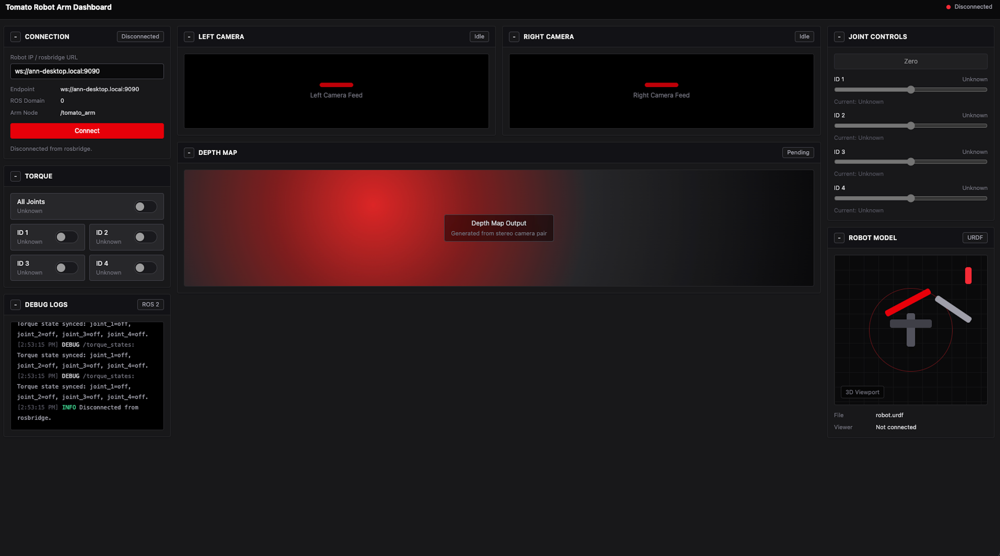


## June 29, 2026
I worked on writing a robot description URDF file by describing the links and joints of the arm. It looks pretty good in rviz. Not sure how I'm gonna use the sim right now, but just having the description is pretty good for now.

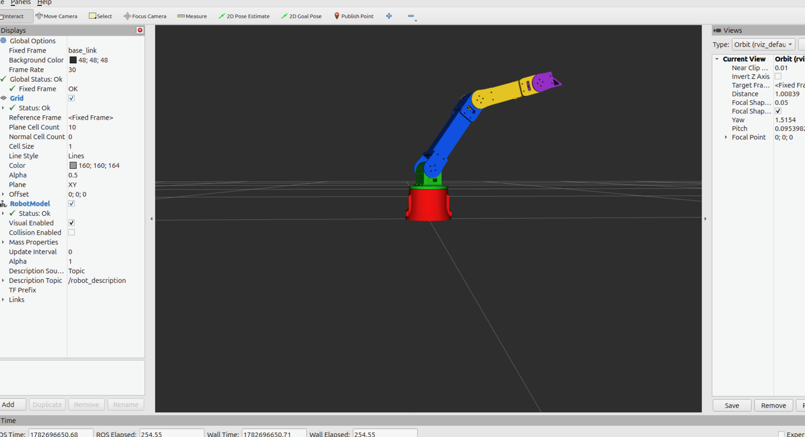

## June 30, 2026
We got a new camera mount set up, so after a bit of a break from perception, I started working on stereo vision again. We got a new camera mount set up, so after a bit of a break from perception, I started working on stereo vision again. Having the cameras physically mounted made the problem feel a lot more tangible, because before this I had mostly been thinking about stereo vision in terms of calibration math and ROS topics or using a half broken camera case.

The first step was getting both cameras publishing properly in ROS. I set up the camera nodes so that each camera had its own parameters, including its own camera ID, topic name, frame ID, and calibration file. Instead of just publishing one ```/camera/image_raw``` topic, I started organizing the system around stereo topics like ```/stereo/left/image_raw``` and ```/stereo/right/image_raw```. This made the camera setup cleaner and closer to what ```stereo_image_proc``` (the ROS package I'm using for stereo) expects.

I also had to think through calibration again now that the cameras were mounted. Since the cameras are not hardware synchronized, I could not rely on perfectly simultaneous frames. I decided to first focus on getting monocular calibration for each camera individually, then use those results as the foundation for stereo calibration. The goal was to get each camera publishing images, as well as correct CameraInfo messages from its calibration YAML.

Oh also I'm using the asymmetric circles calibration pattern.

## July 01, 2026
Today I kept working on stereo calibration. After getting the two mounted cameras publishing as a stereo pair, I started trying to turn the camera setup into a usable stereo system.

The first issue was that stereo calibration is much more sensitive than monocular calibration. With monocular calibration, I only needed each camera to understand its own lens distortion and intrinsics. With stereo calibration, the two cameras also need a correct relationship to each other: their relative rotation, translation, and baseline.

Also the ROS ```camera_calibration``` node is lowk annoying because it takes photos at images it deems as different from other images but idk when it's gonna take a photo so I have to move super slowly because I don't want a motion blur.

## July 02, 2026
Today I moved from monocular calibration into stereo calibration. Uh it did not really work. So I thought it was fine at first because when I did image rectification, the horizontal lines lined up:

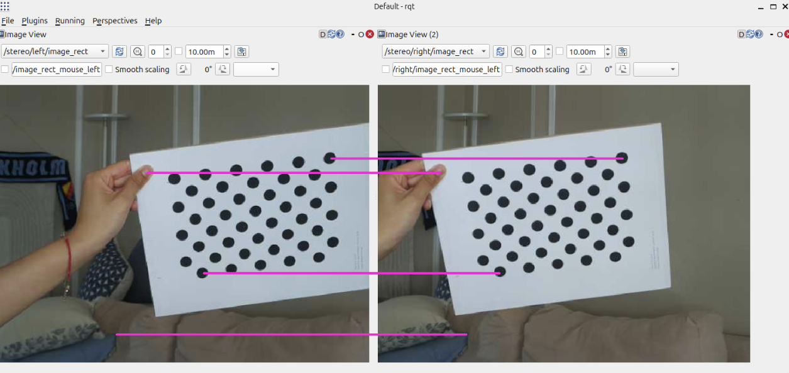

Like surely that's a good sign right lol. The calibration also seemed good at first because the reprojection error looked reasonable. I had a stereo reprojection error around 0.51 px, which made it seem like the calibration was successful. But when I checked the baseline being used by ROS, something was clearly wrong. The physical camera baseline was about 10 cm, but my ```stereo/disparity``` topic was reporting a baseline around 0.203 m, almost double the real distance. Uh so that wasn't good.

I lowk started crashing out after this because it was also 92 degrees in my apartment because the AC stopped working, so I just lied in bed for a couple hours until I had an epiphany about the asymmetric circles pattern.

So basically the problem was I was reporting the distance parameter for my calibration pattern as the distance between the centers of two circles. But ROS actually expects half that distance. Ahaaaa yeah ok. So I recalibrated with that new distance and it worked well.

## July 03, 2026

I moved on to SGBM, which I decided was going to be more effective than Block Matching after some brief stereo matching research.

This was the depth map after no tuning.

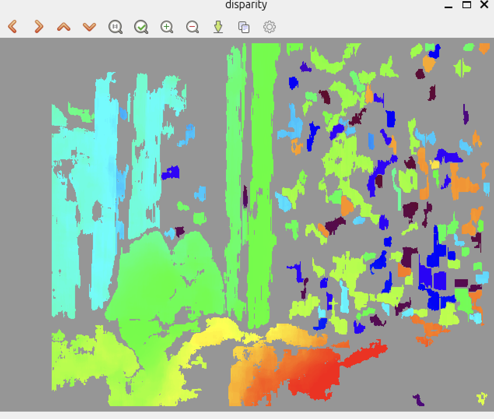

I hung a tomato I bought from Stop and Shop on my coat rack to test the depth.

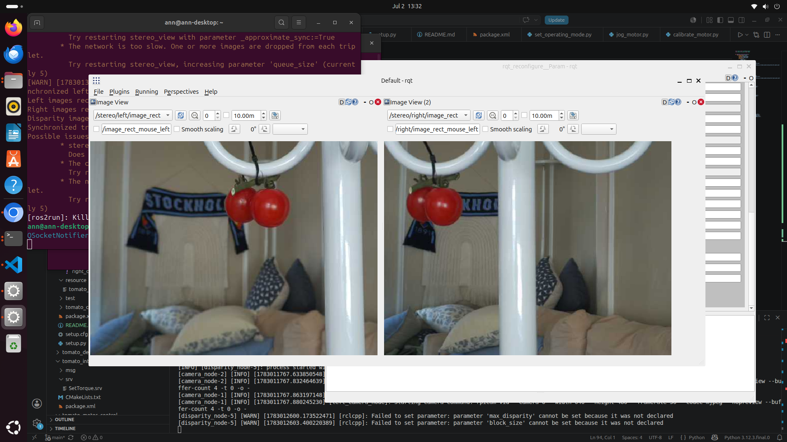

After tuning, the estimate was around 88cm and my measured was around 87. I didn't measure too precisely so further testing is needed, but I this was pretty good for minimal tuning. No image of the depth map right now because everytime I try to open the map, something crashes lol.

## July 06, 2026
We wanted to decide on a camera mount location today. I did some basic calculations with the origin as the shoulder joint. I ended up with the camera mounted at (-20, 0, 65) aimed 45 degrees downwards where x is forwards/backwards, y is left/right, and z is up/down.

I think we're going to need a more sophisticated way to measure the workspace area because right now I'm just doing the length of the arms * 0.6 or 0.8 because I'm basically assuming the robot will hover around 60% to 80% of it's max reach. Idk I think it works for now though.

After taking the derivative of the depth formula, I also calculated that if the the camera is mounted 20 cm behind the shoulder joint, after 1 px error in disparity will result in a 4.73 mm error irl. I think that's fine? Idk maybe we'll have to alter that a bit.


## July 07, 2026
After reading this paper: [A “Global–Local” Visual Servo System for Picking Manipulators](https://www.mdpi.com/1424-8220/20/12/3366), I'm attempting a more complex way of measuring the robot arm workspace rather than just doing 60-80% of the max reach.

My rough steps I'm going to go through over the next couple days:

1. Define robot coordinate system
- I already did this, the origin is the first joint

2. Define arm geometry
- I already did this with the URDF file

3. Learn Denavit–Hartenberg method and define its parameters

4. Implement forward kinematics to define joints

5. Add joint limits
- this is in the URDF file

6. Monte Carlo sample the workplace
- basically for many samples, randomly choose joint angles within the limit and compute the end-effector position with forward kinematics and then plot all the points (this is a method they do in the paper)

7. Choose practical picking region
- from workspace point cloud, pick the region where the tomatos should realistically be harvested

8. Define candidate camera mount poses

9. Transform workspace points into the camera frame

10. Verify camera FOV and that every point in the practical picking regin is in the camera FOV

## July 08, 2026

Today I kept going with the workspace modeling thing from yesterday and finally got the DH + Monte Carlo workflow running. Lowk DH was confusing at first because everyone keeps talking about previous z axes and current x axes like that is supposed to be obvious, but I think I get the basic idea now. Each joint gets a transformation matrix, and multiplying all of them together gives the end-effector position.

First I cleaned up the URDF a bit. I split the wrist and end-effector attachment so the arm still has four active joints, and then the end effector is attached with a fixed joint. So the actual moving joints are still:

1. `joint_1`: base yaw
2. `joint_2`: shoulder pitch
3. `joint_3`: elbow pitch
4. `joint_4`: wrist pitch

and then `joint_5` is just a fixed joint from `wrist_link` to `end_effector_link`.

I also confirmed the coordinate system again because I keep getting paranoid about frames lol. I am using `base_link` as the origin, with `x` forward/back, `y` left/right, and `z` up/down. I also confirmed that all joints set to 0 in RViz is the real robot zero position. In that pose, all the links point straight up, so the end effector should have basically `x = 0` and `y = 0`, and the `z` position should just be the stacked link lengths.

The geometry I used was:

```text
h  = 0.10597 m   # base_link origin to shoulder pitch joint
L1 = 0.1778 m    # shoulder to elbow
L2 = 0.1524 m    # elbow to wrist
L3 = 0.0345 m    # wrist to end_effector_link attachment
```

For the actual tomato contact point, I might later use the full wrist-to-tip offset instead:

```text
L3 = 0.0345 + 0.03193 = 0.06643 m
```

Then I made the DH parameter table. Using `base_link` as the origin:

| i | Joint | Meaning | θᵢ | dᵢ | aᵢ | αᵢ |
|---|---|---|---|---|---|---|
| 1 | `joint_1` | base yaw | q₁ | 0.10597 | 0 | −π/2 |
| 2 | `joint_2` | shoulder pitch | q₂ − π/2 | 0 | 0.1778 | 0 |
| 3 | `joint_3` | elbow pitch | q₃ | 0 | 0.1524 | 0 |
| 4 | `joint_4` | wrist pitch + EE offset | q₄ | 0 | 0.0345 | 0 |

The annoying part was the `q₂ − π/2` offset. It's because the usual DH setup assumes the arm points along +x at zero, but my robot zero pose points straight up. So the offset basically makes the math match my actual robot instead of forcing the robot to match the textbook convention.

I verified the DH model against RViz with `tf2_echo`. For the all-zero pose, RViz/TF gave:

```text
Translation: [-0.000, 0.000, 0.471]
```

The DH model predicted:

```text
z = 0.10597 + 0.1778 + 0.1524 + 0.0345
z = 0.47067 m
```

I also ran some FK checks in code:

```text
zero_pose
  DH matrix FK:   x= 0.00, y=-0.00, z= 47.07 cm
  Fast FK:        x= 0.00, y= 0.00, z= 47.07 cm

shoulder_30_deg
  DH matrix FK:   x= 18.23, y=-0.00, z= 42.18 cm
  Fast FK:        x= 18.23, y= 0.00, z= 42.18 cm

shoulder_90_deg
  DH matrix FK:   x= 36.47, y= 0.00, z= 10.60 cm
  Fast FK:        x= 36.47, y= 0.00, z= 10.60 cm

elbow_30_deg
  DH matrix FK:   x= 9.35, y=-0.00, z= 44.56 cm
  Fast FK:        x= 9.34, y= 0.00, z= 44.56 cm

wrist_30_deg
  DH matrix FK:   x= 1.73, y=-0.00, z= 46.60 cm
  Fast FK:        x= 1.72, y= 0.00, z= 46.60 cm

yaw_90_shoulder_30
  DH matrix FK:   x= 0.00, y= 18.23, z= 42.18 cm
  Fast FK:        x= 0.00, y= 18.23, z= 42.18 cm
```

The `shoulder_90_deg` result made sense because the arm becomes horizontal, so the forward reach is

```text
17.78 + 15.24 + 3.45 = 36.47 cm
```

and the height is just the shoulder height

```text
z = 10.60 cm
```

After that I did the Monte Carlo workspace sampling like in the paper I read yesterday. I sampled 100,000 random joint configurations inside the joint limits, computed the FK for each one, and plotted the reachable end-effector points. I limited `joint_1` to the front half of the robot because for tomato picking idt I care about the arm reaching behind itself right now.

The reachable workspace bounds are below

```text
x range: -36.4 to  36.4 cm
y range: -36.3 to  36.4 cm
z range: -8.8 to  47.1 cm
```

This also makes sense because the current model only goes to the end-effector attachment, not the full tomato contact tip:

```text
17.78 + 15.24 + 3.45 = 36.47 cm
```

Then I defined a practical tomato-picking workspace (this is lowk based on educated vibes)

```text
x = 24 to 32 cm
y = -10 to 10 cm
z = 15 to 20 cm
```

Out of 100,000 sampled configurations, 332 points landed inside that practical workspace:

```text
Points inside practical tomato workspace: 332
Percent inside practical workspace: 0.33%
```

The top-view plot shows the full reachable workspace and the practical picking box. The box is in the forward region around `x = 24–32 cm` and `y = -10 to 10 cm`, which supports my original rough target point with my scuffed math around `(28, 0, 18)` cm. But now the point is justified by the arm's actual reachable workspace.

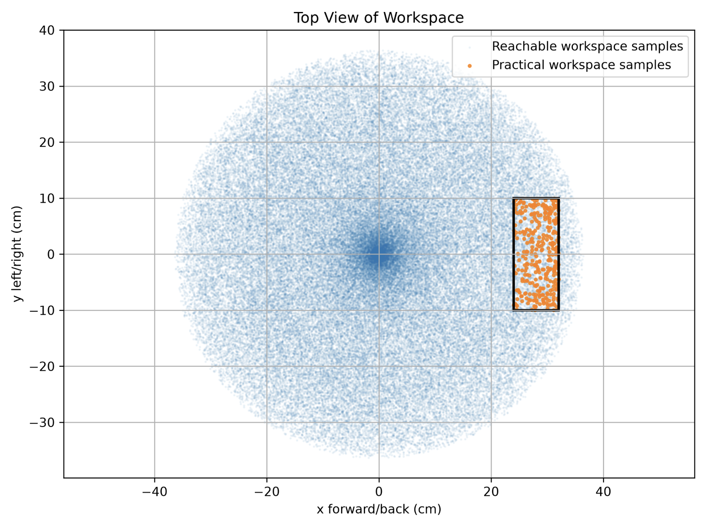

This is an improvement over my initial camera mount calculation because the old method only aimed the camera at one estimated center point. Now I can show the tomato-picking region is reachable, then use those reachable workspace points to evaluate where the stereo camera should go.

## July 10, 2026
After those calculations from a couple days ago, we assembled the base today.

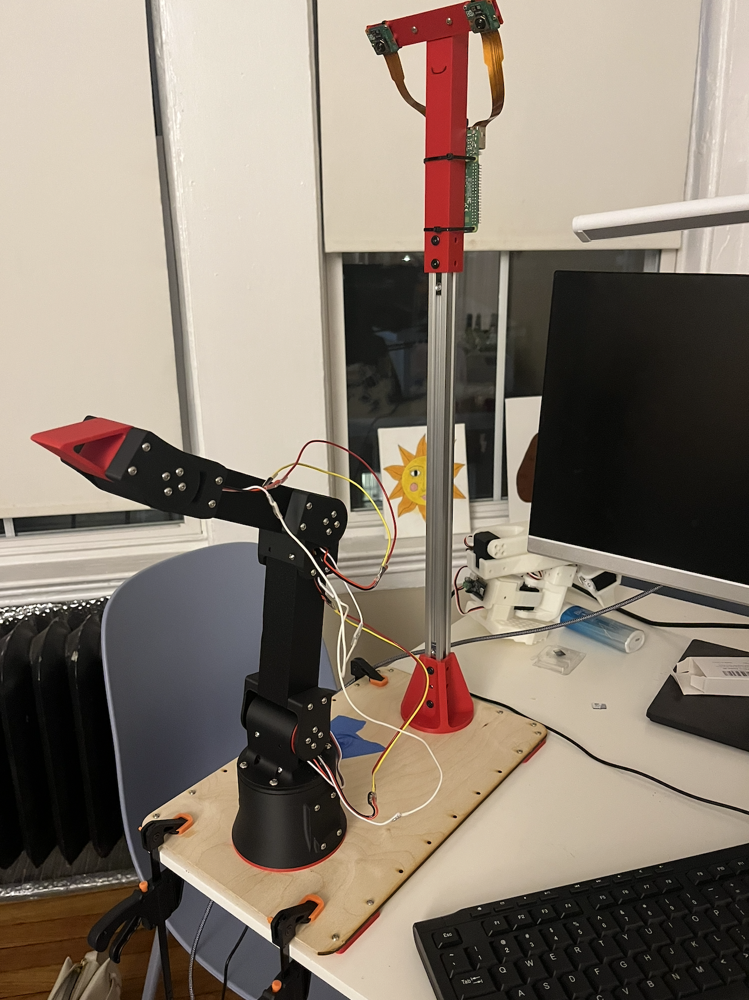
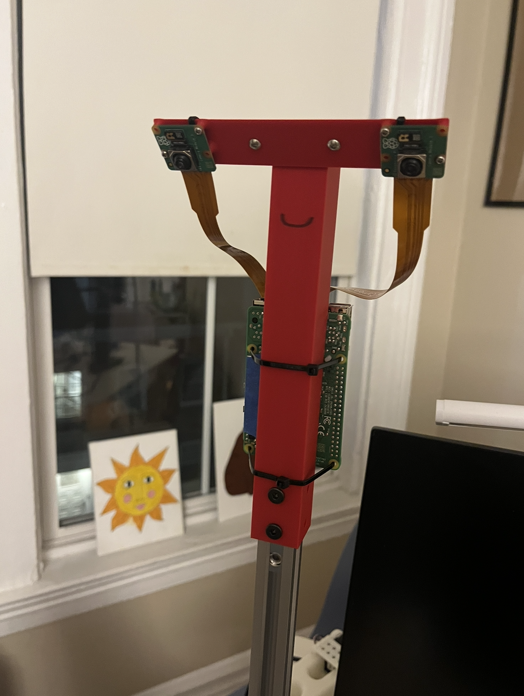

It's finally able to be clamped down to the table and I can move the arm without clutching the base with the other hand. I looked at the cameras and the angle, height, and distance behind from origin all look great, but I'll need to do more testing tomorrow.

The stereo cameras will also need to be recalibrated because the image rectification doesn't look accurate anymore.

Motors also need to be recalibrated so the zero position has the base rotation the right direction.

## July 11, 2026
Motors and cameras have been recalibrated. The depth map also looks good. Yes I'm using an apple jellycat as a tomato.

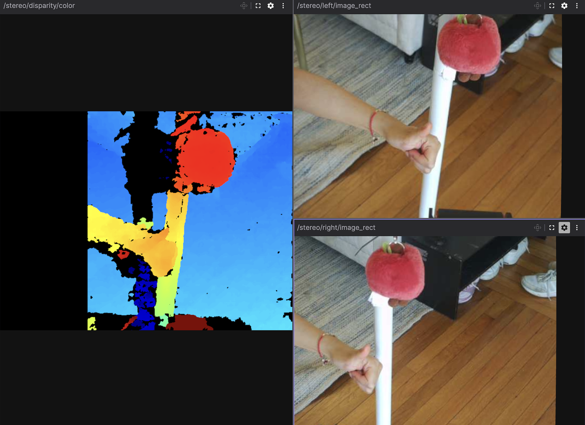

From my brief testing, the depth calculation from the disparity map also looks pretty accurate. It's around 70cm away from the camera.

Tomorrow I'm planning on building out the rest of the pipeline before eye-to-hand calibration and kinematics:

1. Take ROI from left camera image (from YOLO tomato detection or maybe manual for now idk because I only have an apple jellycat)
2. Look at the same ROI in the disparity map
3. Compute the median disparity of the valid pixels
4. Compute depth in cm
5. Compute 3d coordinate of the tomato center

## July 12, 2026
I made my way through the pipeline today.

### ROI
When I take the ROI from the left camera image, I shrink it by 20%, so I only get the enter of the tomato and not the edges, which would make the depth farther than the surface would be.

### 3D Position Estimation

Once the median disparity is computed, I convert it into depth using the stereo camera model,

\[
Z = \frac{fB}{d},
\]

where \(f\) is the focal length, \(B\) is the stereo baseline, and \(d\) is the median disparity. Using the camera intrinsics from the left camera, I then back-project the center of the detection into a 3D point in the left camera frame. This gives the estimated position of the tomato relative to the camera.


### Eye-to-hand calibration
I also did eye-to-hand calibration, which wasn't really calibration or more just math to find a final matrix transformation because I knew where the camera was with respect to the robot origin.


### Controller Pipeline

With the 3D position available in the robot base frame, I completed the first version of the controller. It synchronizes the ripeness detections with the stereo disparity image, computes the 3D position of every detected tomato, and filters out detections with unreliable disparity estimates. For each valid tomato, it computes the corresponding position in the robot base frame and prepares a simple horizontal approach consisting of pregrasp, contact, and retreat waypoints. So basically each approach has three segments. These waypoints are then passed into the inverse kinematics solver to compute the required joint angles.

### IK

The math of IK is below. I first find the base yaw and then only focus on joint 2 and 3. For joint 4, I'm just assuming I approach horizontally for now to simplify things.


Uh so as for the outcome. It's lowk kinda scuffed right now lol


Idk we'll debug it tomorrow. Likely issues are

1. Robot thinks tomato is farther than it is
2. camera to base transformation is wrong
3. IK is wrong
4. Contact point is js too aggressive
5. Controller is commanding center of tomato instead of surface
6. URDF has issues

## July 13, 2026
Lots of debugging today. Yesterday the robot was moving in vaguely the correct direction, but there were enough possible sources of error that I basically went through the whole motion pipeline one piece at a time.

First I checked the URDF geometry. I verified the zero pose, all the link-frame positions, the joint rotation directions, and the new ```tool_tip_link```. With every joint at zero, the tool tip ended up at the expected height:

```
0.10597 + 0.1778 + 0.1524 + 0.0345 + 0.03193 = 0.50260 m
```

So the URDF geometry seems fine. I also confirmed that the full wrist-to-suction-tip length is 0.06643 m, not just the 0.0345 m fixed joint that goes to the beginning of the end effector.

Then I checked the analytical IK solver. The actual planar IK math was mostly correct, but the solver was only loading ```joint_5``` from the URDF and was ignoring the additional ```tool_tip_joint```. This meant it thought the tool was 3.193 cm shorter than it actually is, which is lowk a huge issue when trying to touch the tomato surface accurately. That's why I was having issues yesterday with the tomato not being in reach when it was clearly in reach. I updated it so the full tool length is included.

After that I tested the manually defined camera-to-base transform by itself. I published fake points in the left camera optical frame and visualized the camera origin, optical axes, viewing ray, and transformed point in RViz. I checked movements along camera +X, +Y, and +Z, and they all mapped into the expected robot directions. So the basic transform math also seems correct.

The image below is the transformation of the camera point (0, 0, 0.5), basically 50 cm in front of the camera.
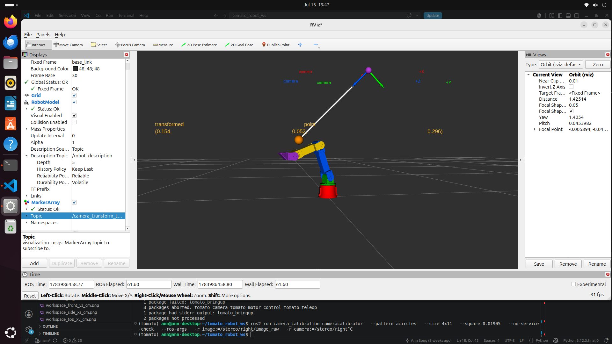

Next I tested back-projection using the real rectified CameraInfo. I took a known pixel and depth and converted it into a 3D camera-frame point using:

```
X = (u - cx)Z / fx
Y = (v - cy)Z / fy
Z = depth
```

I didn't see any issues there, so I just decided to send it lol.

First attempt today:


This looked ok but I started tuning some offsets.

I also found that joint 1 (the base joint) was inverted after this attempt.


After fixing that, I started finding that it was consistently overshooting, so I changed the percentile of disparity to 75, so that it would value the greater disparities (greater disparity means object is closer), so it essentially prioritizes the center of the tomato the most, which is the closest.

Then I started seeing that it was consistently below the tomato with these attempts:


At the end, I basically had three offsets for all three axes. This is what we ended the day with (big wait in between first and second execution because I was bypassing safeguards I set up):


Pretty happy with the result. I'm slightly concerned with the offsets being specific to this apple jellycat, so we'll have to verify that. I'm gonna print some custom tomatos that are actually accurately sized tomorrow to hopefully have multiple tomatos on the coat rack lol.

## July 15, 2026
I assembled my mock tomato plant today with some questionable looking 3D printed tomatoes.

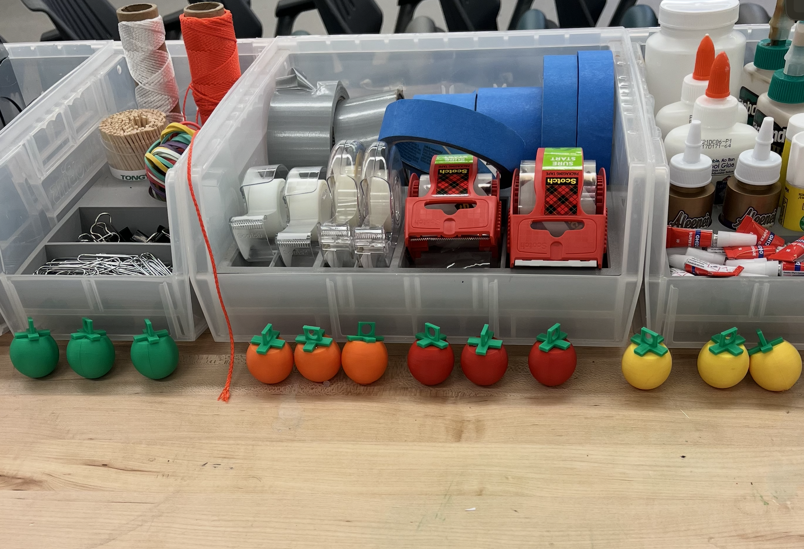

Then I assembled them onto a coat rack.

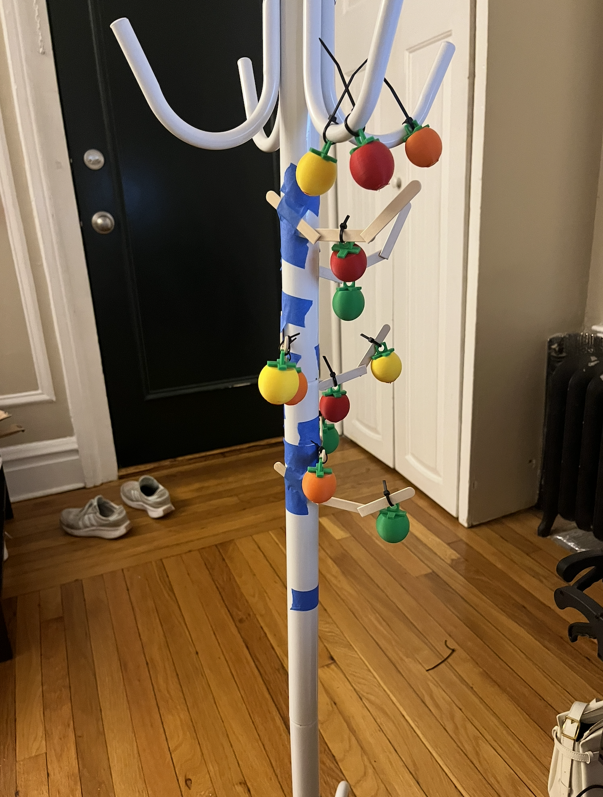

View from the stereo camera and YOLO detection:

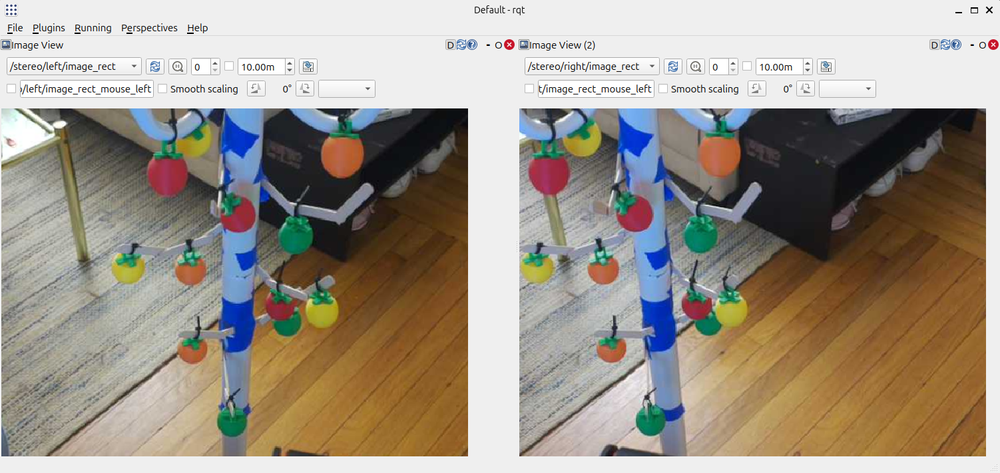
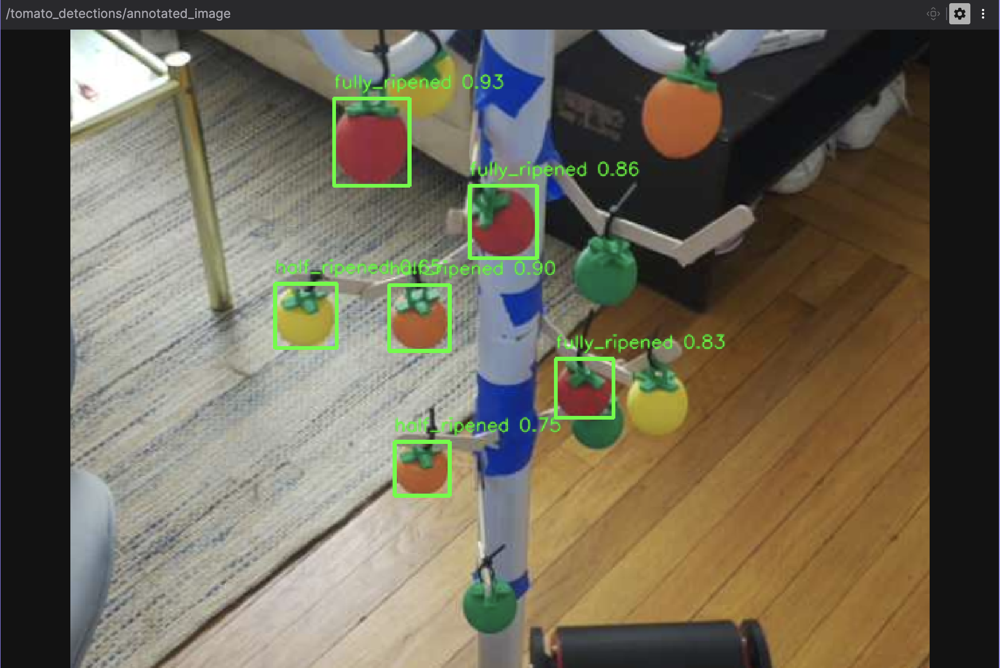

## July 17, 2026

I spent the past couple days expanding the robot from approaching one tomato into an actual multi-tomato harvesting pipeline. This built on the first controller and IK system I had working earlier, where the robot estimated a tomato’s 3D position and generated pregrasp, contact, and retreat waypoints.

The perception system can now detect multiple tomatoes at once and give each one a persistent ID. Originally the detection IDs were regenerated every frame, which made them switch around constantly and made selecting a specific tomato really difficult.

I also expanded the dashboard so I can see all detected tomatoes, their ripeness and confidence, and manually select a reachable tomato by ID.

Once movement is approved, the robot now runs through the full harvesting sequence:

```pregrasp → contact → hold → retreat → return home → resume scanning```

Here is the whole pipeline with the dashboard:


The workflow is basically you select a tomato that's reachable, approve to move end effector to the tomato, retract arm when you're ready and then the controller goes back to scanning reachable tomatoes.

I do find it pretty annoying that some tomatoes are in reach and then the next frame they're not. This is definitely because of some noise in the disparity map of the stereo cameras. Another issue I see is that between tomatoes, it takes a long time to rescan. All possible areas for improvement for sure.

## July 18, 2026

We connected the vacuum end effector to the arm today. 

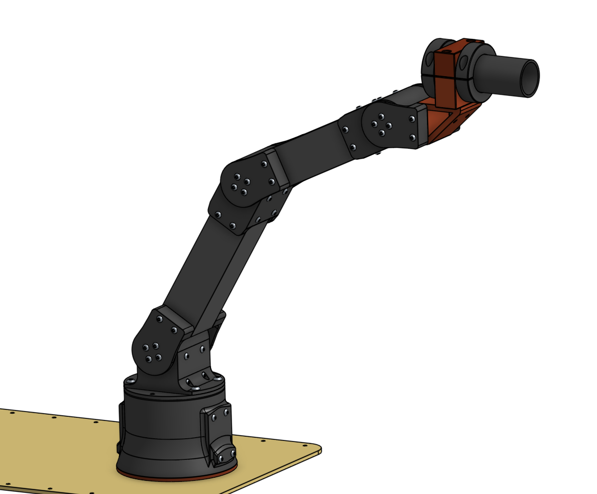
<!-- 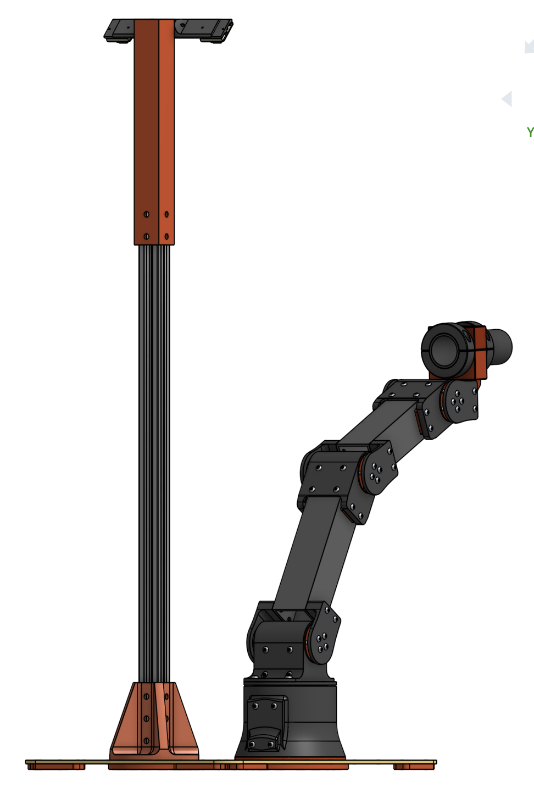 -->
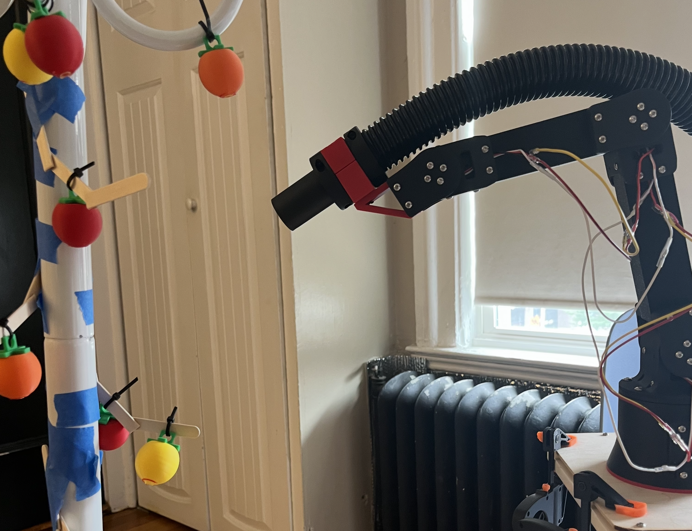

While this was a big step towards an actual working prototype, there were some unexpected consequences of attaching the vacuum. The main problem was that the vacuum tube is inflexible, so the wrist can't bend backwards. The wrist has effectively lost half of its range of motion.

The problem with losing half of its range of motion is that a lot of tomatos that were previously pickable are now deemed as unreachable. An example below:

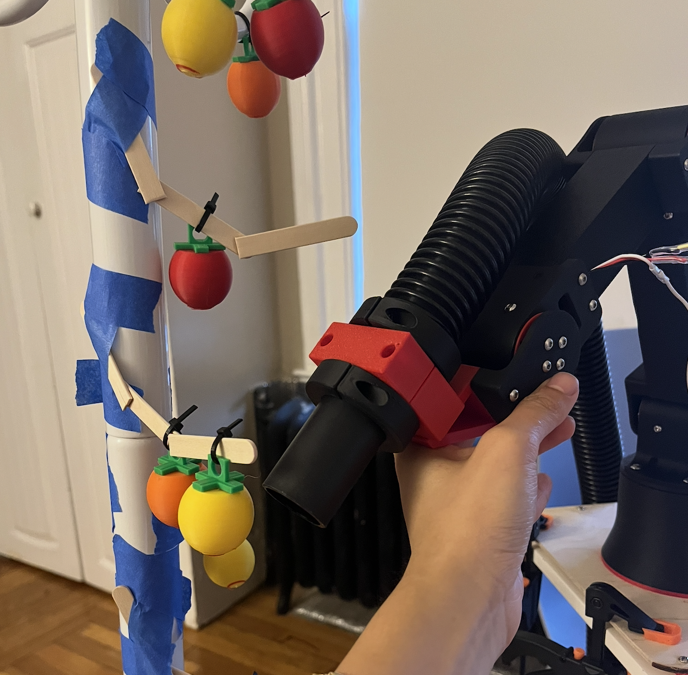

We want the wrist to approach horizontally from the front (perpendicular to the axis of calyx). If the wrist could rotate backwards, it would have a better shot. In general, the new end effector being longer and also having a positive z offset is making a lot of tomatoes unreachable from the current distance from the base. In fact, the max reach of the arm has increased 6 cm from 40cm to around 46cm, so this is not unexpected.

Now the obvious solution is to just move the tomatos farther away and have the pickable area be around 40-50cm instead of 30-40cm as it is right now. However, the problem with that is I did my calculatioins on camera height, pitch, and distance behind base with the initial max reach of 40cm, so if I move it far enough away that more tomatoes are reachable for the arm, the camera can't see them anymore.

We have a few solutions. Either increase camera height, move camera closer to the base, or change camera pitch. Camera pitch is the easiest for us to change, so I set up a simulation in gazebo to try out different angles.

Right now we are at 45 degrees and below is 30 degrees, 35 degrees, and 40 degrees. The tomato plant is 55cm tall and the tallest tomatoes are at around 50cm.


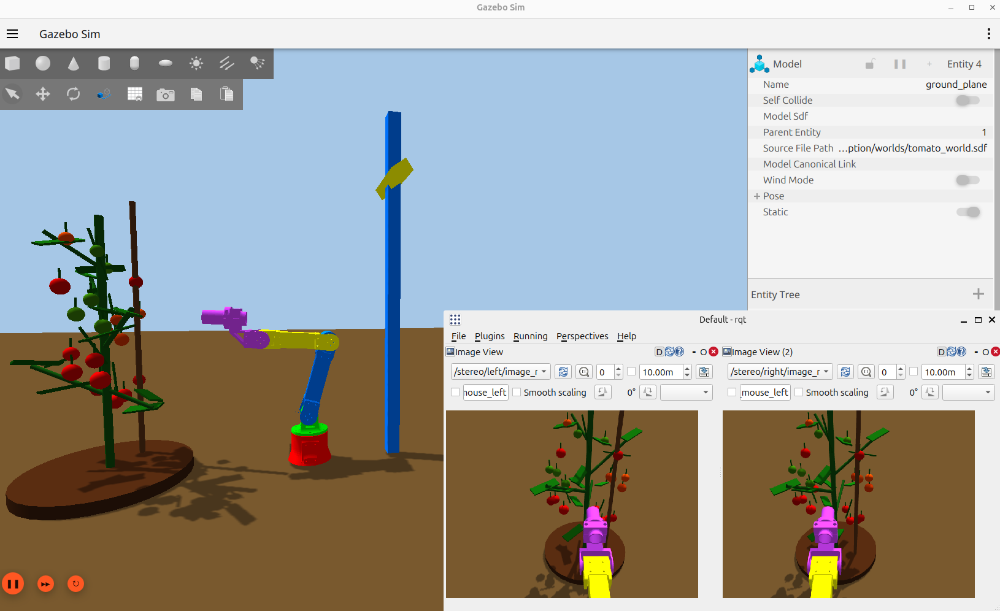
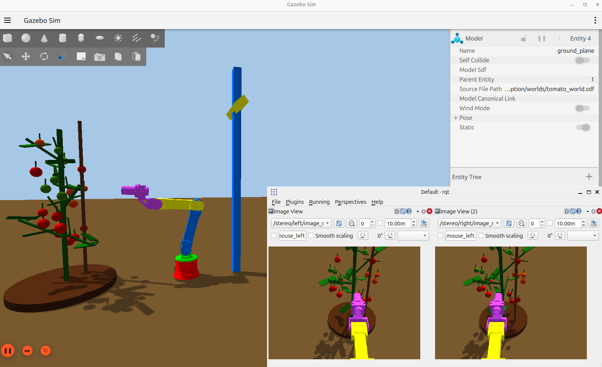

35 degrees looks like a nice in between. I'll probably do some calculations tomorrow to confirm, but just visually speaking, 30 degrees captures the entire plant, but the top is kinda unnecessary because the robot can't reach those anyway. 40 degrees obscures some top tomatoes that we might have a shot at, so I think 35 degrees is a good middle ground.

## July 20, 2026
A couple of things happened today. First we changed the camera from 45 degrees downwards to 35 degrees. After that, I proceeded to break the arm.

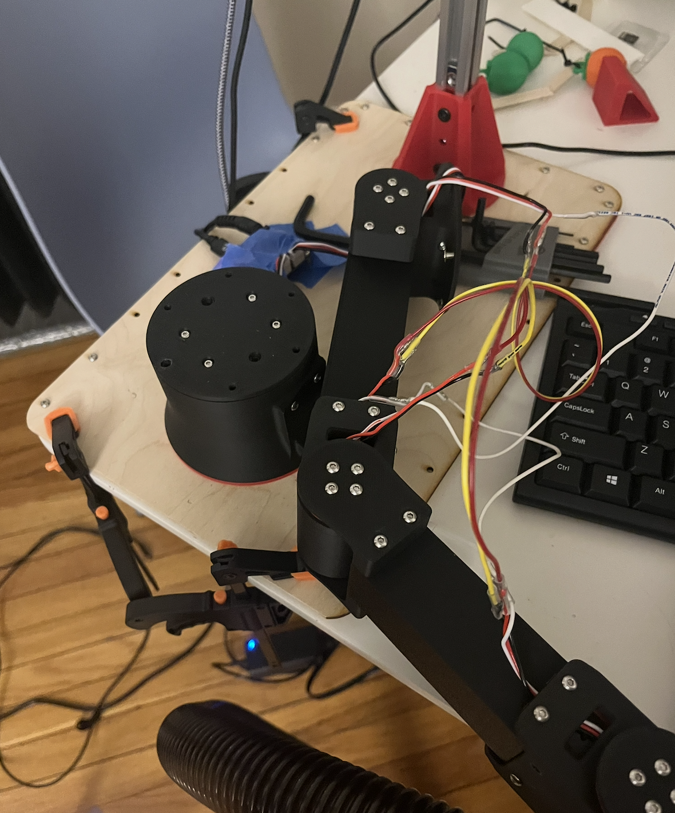

So I think the progress cancels out lol

## July 21, 2026

We fixed the broken arm today and also modified the vacuum so it no longer blocks the wrist's range of motion.

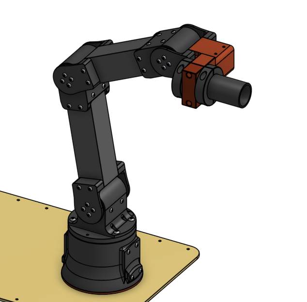
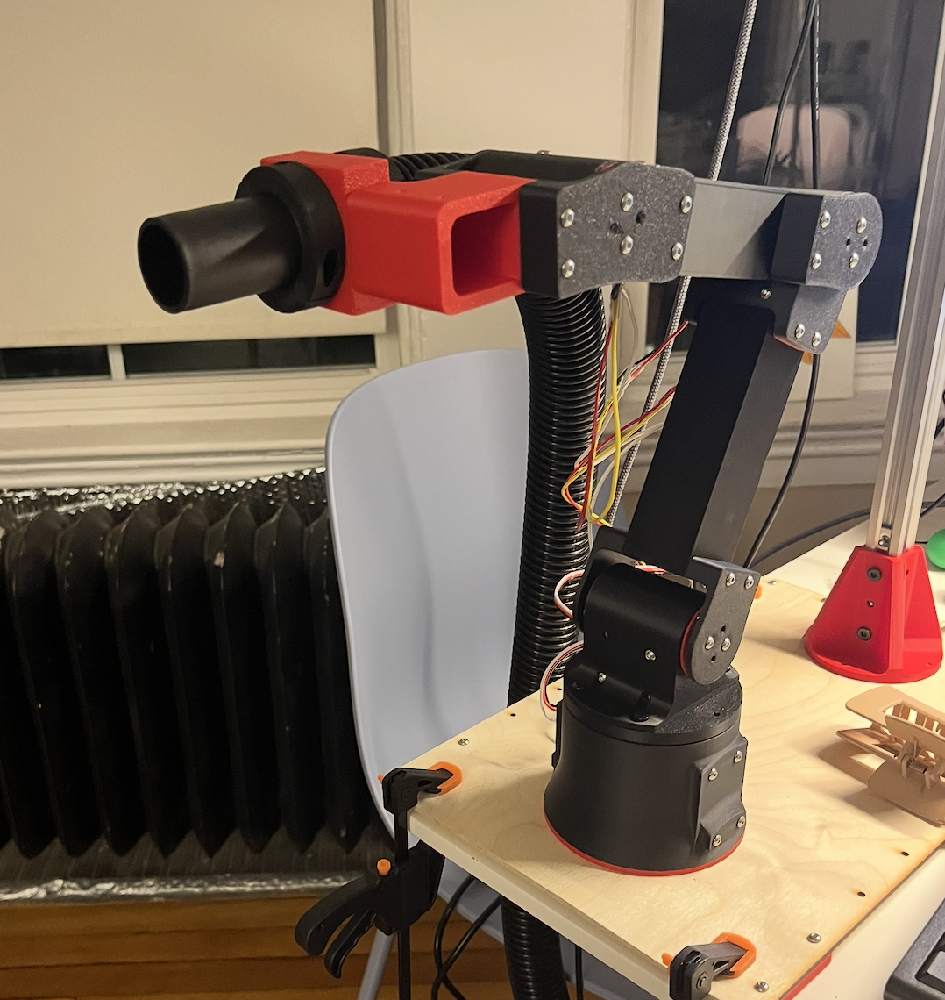

## July 22, 2026

After some tuning, we've made it back to our baseline last week in terms of moving towards tomatoes autonomously.


Still need to do a lot of tuning, but good to feel like I didn't only make negative progres this last week lol.

Right now, the main issues I see is the position relative to the robot origin is in the center of the tomato if the tomato is low, but it is the top 75% of the tomato if the tomato is high. This makes it so that a universal offset for z won't work. Another issue I see is that some tomatoes labeled as not reachable are in fact very reachable, so that needs debugging as well.

## July 25, 2026

We tested on real tomatoes today! Packing up the arm and bringing it into the field made this feel a lot more real ngl.

### Successes:
- Depth seems reliable when it's tuned at the correct depth range. Cherry tomatoes are smaller than the artificial ones I printed, so there was more room for error
- Successfully sucked a tomato!
- Arm is able to approach from a variety of angles

We did have to do a bit of tuning, but the offsets were very minimal.

This was one of the first attempts before any tuning (velocity was turned down for testing).


After tuning, approaching at different starting locations:


Here is the arm finally sucking the tomato. It'll be missed.


Obviously this was an easy tomato because it's isolated and the calyx dangles at the top, but this is a good start.

In general though:

### Observations:
- Cherry tomatoes are smaller than my 3D printed ones, so depth error is a little more forgiving
- Tomatoes tend to grow vertically, so there are not many tomatoes at the height in which I did most of my testing
- There are many leaf occlusions

### Problems we found:

1. Since tomatoes were higher than usual, there ended up being a trade off between x (forward distance) and depth. Essentially, SGBM tuning was done for a depth of around 60cm - 80cm, but the tomatoes we were going for were around 40-50cm of depth because they were so high up. In order for tomatoes to be in 60cm - 80cm, we would have to go for higher tomatoes, but the arm can't reach that high. My testing didn't have this issue because we simply had lower tomatoes with a greater x, which brought it to the 60cm - 80cm range. One of the main improvements is making SGBM more robust to greater ranges of depth so we don't need to retune on the fly.

This exposed two limitations:

The arm’s vertical workspace does not align well with the natural distribution of tomatoes.
The current SGBM configuration is not reliable across the full 40–80 cm operating range.

2. The cameras covered a much smaller area than expected, making it difficult to locate tomatoes and observe the surrounding plant. The effective field of view may be limited by the selected camera mode, stereo rectification, projection matrices? Lowk no idea because the camera should see more.

3. Dashboard I made is super slow. I don't know if this is because of the heat? Maybe rosbridge was tweaking? But I ended up needing to send all the commands through terminal to approach and retract the arm, which made figuring out which tomato we were going for very hard.

### Next steps:

1. Build an elevator for the arm and cameras

We're going to build an elevator that raises the arm and stereo cameras together. Moving both on one rigid carriage will shift the tested working volume vertically while preserving the camera-to-arm transform.

Redesigning the arm for substantially greater vertical reach would require larger mechanical, financial, and software changes. Not trying to do all that right now. An elevator is more practical for the current prototype plus we'll need one eventually anyway.

2. Make SGBM reliable across more depths

Additionally, I'm going to figure out how to make the SGBM parameters work for a variety of depths. No idea how yet, but we'll do some research.

3. Camera FOV

I'll probably compare the raw, rectified, and dashboard camera images to determine where the field of view is being lost.

4. Dashboard

Idk yet but it's gotta get less laggy.

## July 26, 2026
I worked on problem 1 and 2 from the field test. So turns out they were both just symptoms of the same problem.


### The cameras were only looking at the middle of the sensor

So I was not aware of sensor mode on the cameras, so I never set the mode, so libcamera was picking the smallest one that fit my requested resolution of 640x480. Also asking for a 4:3 image on a 16:9 sensor cropped it again lol it's no wonder the FOV is so bad. Between the two I was throwing away about half the horizontal field before anything else happened.

On top of that, SGBM can't produce depth in a strip along the left edge of the
image, because the search runs off the side of the other camera's image. That strip
was over 40% of the frame. So the part of the image that actually had depth was
tiny, and it was all shoved to one side.

### Autofocus has never actually worked

While setting up to recalibrate I checked what the lens was doing, and the focus
position never changed. It was at about 33 cm the whole time, so basically
everything I've ever captured has been out of focus lmao.

Manual focus works fine, so it's the autofocus algorithm and not the hardware.
I also found the two cameras need different focus commands to be sharp at the same
distance, so they each get their own value now. Focus is locked permanently, since
a calibration is only valid at the focus it was taken at. I locked it at around 55 cm.

### Testing three configs

I built a small tool that locks onto a target, logs depth over 50 frames, and
compares it against a tape measurement. Then I ran the same sweep at a bunch of
distances for three setups:

- Current — what I took to the field
- A — low resolution, fast
- B — medium resolution

| | Current | A | B |
|---|---|---|---|
| usable view for depth | very narrow | ~2.5× wider | ~2.5× wider |
| depth range | 0.4–0.7 m | 0.3–1.3 m | 0.3–1.4 m |
| accuracy | consistently off by ~4% | good | good |
| consistency | fine | occasionally very bad | always good |
| speed | slow | very fast | slow |


Going with B. It's slower than I'd like, honestly slower than the old config,
but I'd rather trust the depth and fix speed as a separate problem. A is still
available as a launch option since it's much faster if I need it.

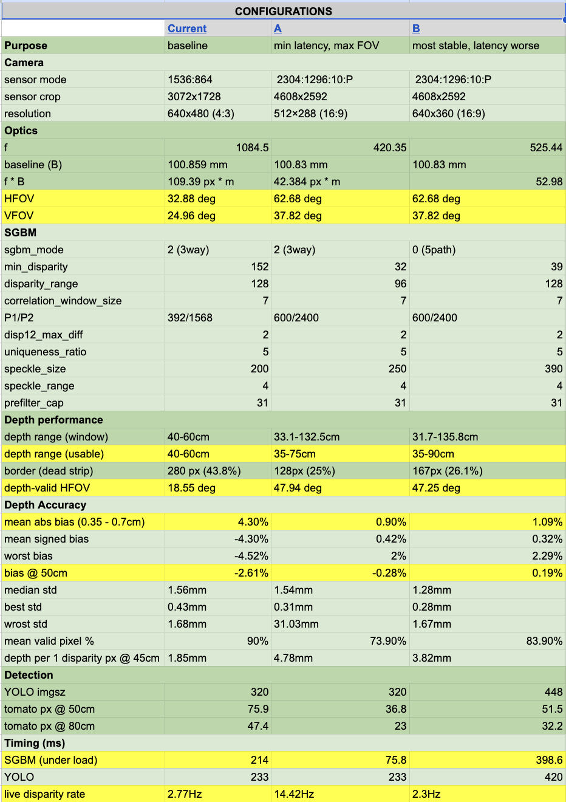

I also found that both configs start getting worse at long range because the tomato gets too small in the image for the matching window in SGBM to fit inside it.

So in theoryyy, depth is a lot lot better now but who knows wut it'll be like in a more chaotic environment.

## August 20, 2026
Busy weeks moving in and out of apartments and tracking down metal to build the elevator. Elevator moved, but stepper motor driver dies quickly.


It's quite difficult to transport, so it'll probably be a while until the arm and elevator are integrated. Since the elevator isn't a unique DOF, the arm and elevator are not modularly distinct, so it's hard to test without integrating them together. Most elevator testing will probably be in simulation because it's so hard to move the elevator to a space where both of us can work on it.

## August 21, 2026
I decided on a configuration for the wrist camera today. Putting the justification for a wrist camera and rationale below for my own reference:

### Why add wrist camera
Target confirmation: confirm that the tomato selected by the external stereo system is still in the expected local region that overhead camera said

Visual servoing: measure the target’s image-space error relative to the desired pickup point and command small corrective motions during the final approach.

Compensation for model error: correct residual error from stereo depth noise, extrinsic calibration, servo backlash/compliance, and imperfect kinematics.

There is also future potential for using these two cameras to train an ACT or implement a small VLA.

By visual-servoing, I mean something potentially very simple like setting (u, v) as the observed tomato center and (u*, v*) is the desired image location for the selected approach geometry and then setting e = (u - u*, v - v*).

### Camera selection

Arducam 8MP A219 / IMX219 autofocus USB2 UVC camera, upgraded HDR variant (B029202 family). Putting amazon link [here](https://www.amazon.com/gp/product/B0FLX4T1BY)

We had to go with a USB camera because the Pi's CSI ports are already taken by the Pi cameras and I'm not tryna buy a hat.

 | Property | Value | Notes |
  |---|---|---|
  | Interface | USB 2.0 |  |
  | Sensor | 8MP IMX219 color sensor | Good for detecting warm tomato colors from green leaves |
  | Resolution Details | 1920x1080 @ 30fps MPJEG | |
  | Autofocus | 10cm to infinity | I don't think 10cm is an issue? The camera will definitely be able to see way past 10cm like closer to 2cm away from the tomato but I don't think it really matters that it won't be in focus because it's just the color red at the end of the day? |
  | HFOV | 61 degrees | |
  | VFOV | 50 degrees | |
  | Shutter | Rolling | Frankly I don't know enough about the difference to know any of the potential impacts |

### Coordinate definition

| Property | Definition | Interpretation |
| Nozzle tip center | O = (0, 0, 0) | Reference origin |
| Tool axis | +x | Positive x is forward towards nozzle tip |
| Left direction (from perspective of robot) | +y | Camera mounted at a negative y value |
| Vertical direction | +z | Fixed h = 0 for this design, camera is inline with reference origin z |

### Placement geometry
These are the preliminary values chosen:

| Property | Definition | Interpretation |
| Camera optical center | C = (-40, -60, 0) mm | 40 mm behind, 60 mm to the right, inline height |
| Yaw | +x | 25.5 degrees | 25.5 degrees pointing towards tool axis
| Nozzle diameter | 31.75 mm (1.25 inches) |  |
| Vertical direction | +z | Fixed h = 0 for this design, camera is inline with reference origin z |

Current end-effector assembly used as physical mounting reference:
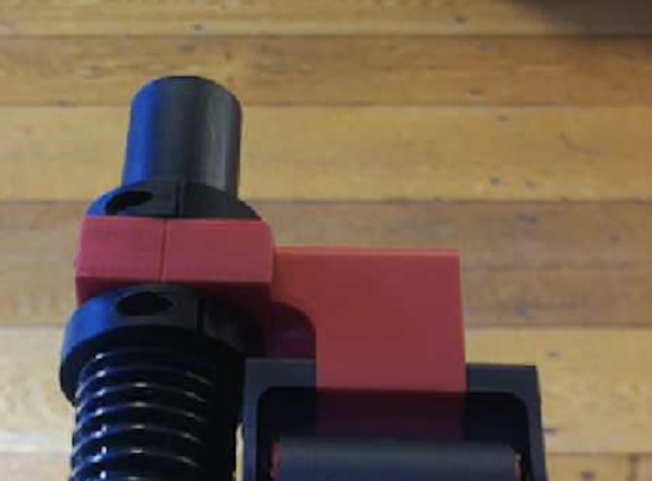

Visually sketched out:
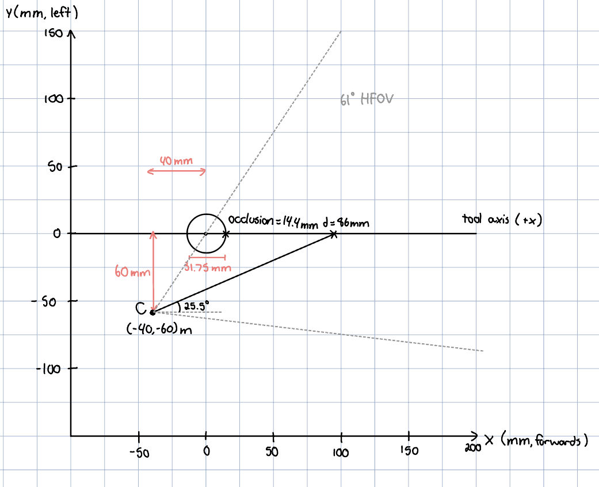

### Effect of geometry

#### Occlusion point
When choosing the lateral offset, the x distance from the tomato when the wrist camera goes blind from nozzle occlusion was the main consideration.

\[
x_{occ} = \frac{rL}{(b - r)}
\]

where L is x position (amount behind), b is lateral offset, and r is the radius of the nozzle.

Plugging in the values of r, L, and b:

\[
x_{occ} = \frac{15.875 * 40}{(60 - 15.875)} = 14.4 mm
\]

Under this model, the center of a tomato on the tool axis remains geometrically visible until the nozzle is about 14.4 mm away. Below this distance, the line of sight to the tomato center intersects the nozzle disk. This should be fine because once the tomato is only around a centimeter away, if it still somehow misses because of wind then honestly I don't know what to tell you.

#### "Look ahead" distance
We don't want the camera to see exactly where the tip is currently. We want it to see quite a bit ahead to make changes before the tip does something that's not reversible. This "look ahead" distance is a consequence of the yaw, L, and b

\[
d = \frac{b}{\tan(\theta)} - L
\]

\[
d = \frac{60}{tan(25.5)} - 40 = 85.8 mm
\]

Therefore, the camera is centered on a point about 86 mm in front of the nozzle tip. This should be fine for visual servoing. A tomato passes through the center of the image while the robot still has roughly 8.6 cm of forward travel available for correction.

Oh I forgot to mention the yaw. It was chosen to angularly center the predicted ~40-200mm workspace area.

## August 22, 2026

Two main things today

1. Replaced coat rack testing setup (It was my subletter's so I don't have access to it in my dorm)
2. YOLO testing

### New Testing Environment
Part of me wants to call this a test fixture but that's probably being too generous. For this test, I wanted to also simulate the greenery of tomato plants.

Basically what I did was glue a bunch of pictures of leaves on a big cardboard piece and then I took toothpicks and painted them green and stuck them into the cardboard as stems. Then I printed the same tomatoes as earlier (a little smaller) and the calyx can slide into the toothpicks. I really like the toothpick idea, makes every tomato position up to me and reconfigurable.

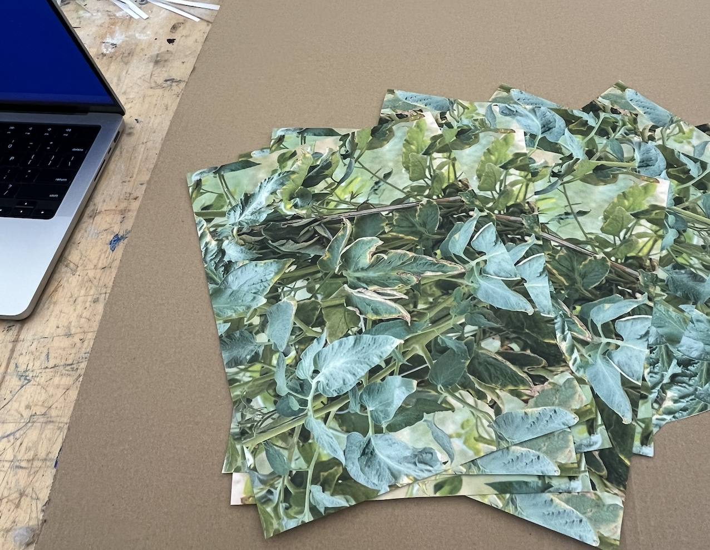
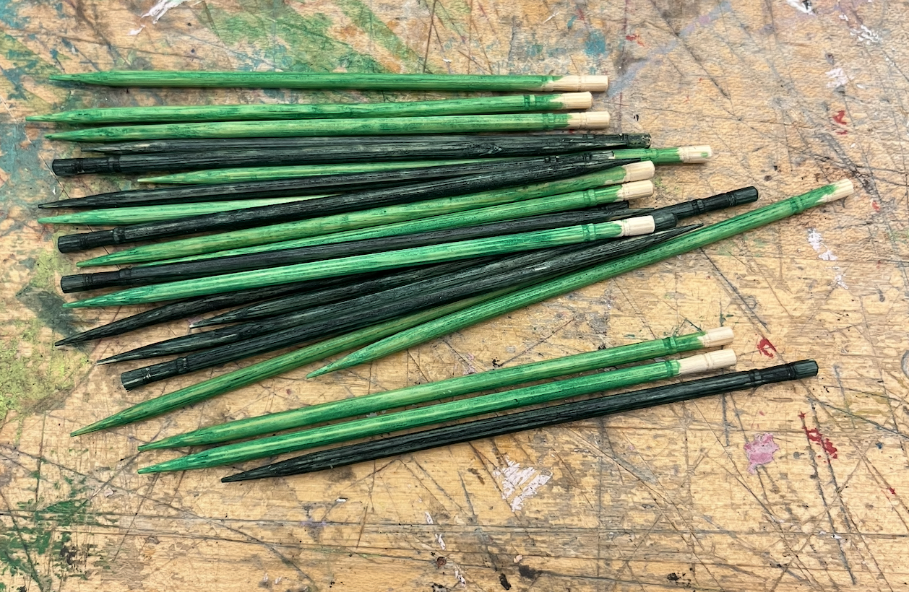

When it's not being used to test, it's wall art for our common room lol
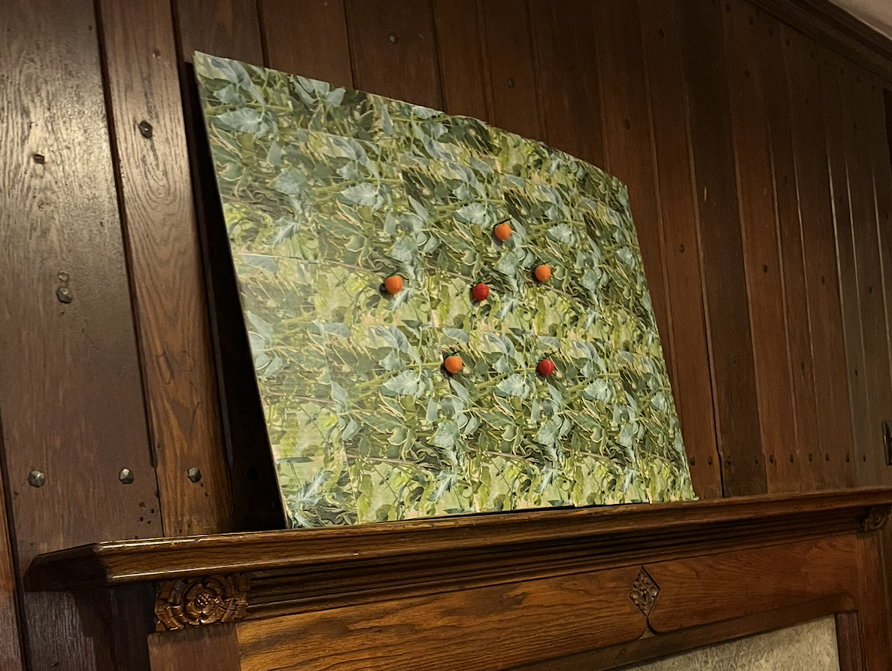

I'm also thinking about hanging it from the ceiling with a 3d printed towel hook and some string.
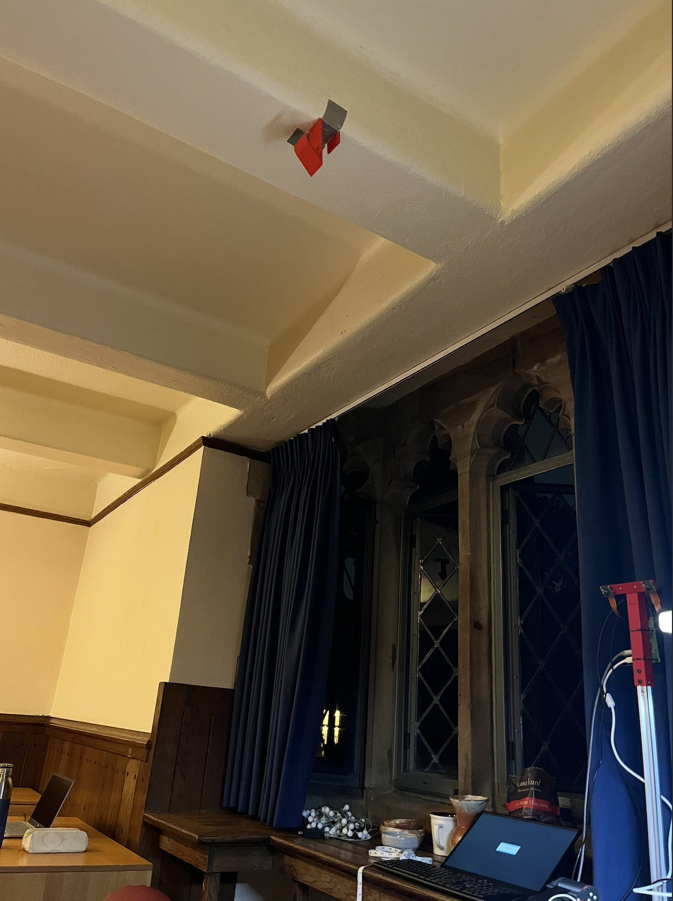

### YOLO Testing
The issue was that detection only worked when the tomato was pretty close, but the arm wants to work farther out than that. My first guess was that this was a dataset problem, like Laboro was trained on images where the tomatoes took up way more of the frame than mine do, so the model just never learned what a tiny cherry tomato looks like. Turns out that was wrong lol

#### Measuring the two frames

I grabbed two rqt screenshots, one at the distance the arm actually wants to work at and one at the distance where detection starts working.

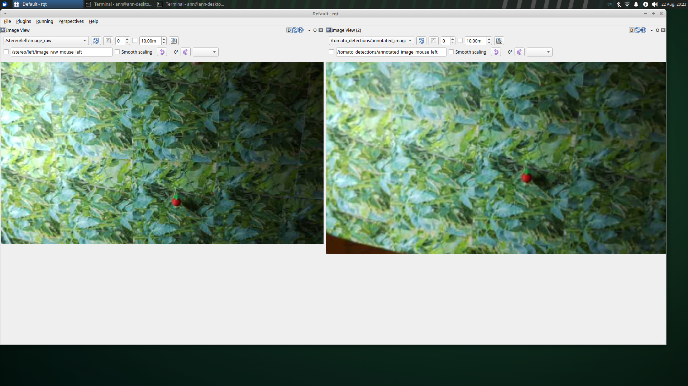
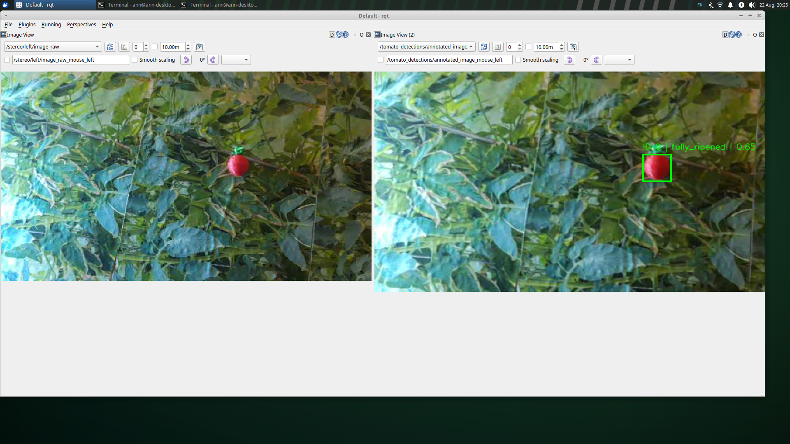

The rqt image panes render at 1.408x, so I had to divide out the display scale to get real sensor pixels:

| | tomato diameter | estimated Z |
|---|---|---|
| too far | 15.6 px | ~82 cm |
| close enough | 30.5 px | ~42 cm |

#### Was it the training data (no prolly not)

First I pulled the training args straight out of the `.pt` checkpoints. All three were trained at `imgsz=640`, 300 epochs, Ultralytics defaults, so `scale=0.5`, `mosaic=1.0`, `multi_scale=0.0`. Mosaic quarters instances, so the training set already covered a pretty wide range of apparent sizes. That already made me suspicious of my own hypothesis.

Then I ran the actual test. Same two frames, `yolo11s_6`, conf floor dropped to 0.05 so I could see what the model was really thinking:

```
                 imgsz=640   imgsz=960   imgsz=1280
near (30.5px)      0.86        0.91         0.88
far  (15.6px)      0.42        0.68         0.68
```

So no, it is not the training data:

1. The exact same model works fine on the exact same tomato at 0.86-0.91 when it's 30 px, so it does know what tomatoes look like.
2. Upscaling recovers the far case with no retraining at all. Upscaling adds no new information**, it only adds grid cells.

#### Changing imgsz

Going from 640 to 960 takes the far edge of the workspace from 0.42 to 0.68. My `yolo_conf` is 0.4, so 0.42 was literally sitting on the threshold, which explains why detection was flickery instead of cleanly failing. At 960 the true detection is 0.68 and the best false positive is 0.20.

Cost is roughly 2.2 s/frame vs 1.0 s at 640.

The bounding boxes don't all show up, but they're tracked down in the terminal:

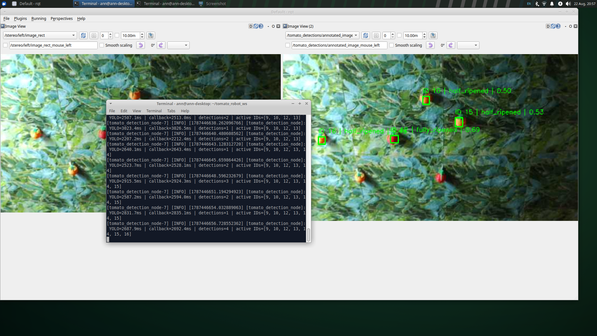


#### ROI (saving this for tomorrow)

So the IMX708 only has three sensor modes, so there's no intermediate one. But `rpicam-vid --roi` sets a digital crop and gives continuous FOV control, so I'll probably look into this tomorrow. Even though YOLO works well, VFOV is still quite small at like 25 degrees and even though we have the elevator we probably want it closer to 30+.

## August 28, 2026

After a lot of iterations, we tested on real tomatoes for the second time today.


### Problems from July 25

| # | Problem from July 25 | Solution |
|---|---|---|
| 1 | SGBM was tuned for ~60–80 cm, but tomatoes grow high so the actual working depth was ~40–50 cm. Trade off between forward distance (x) and depth, and we had to retune on the fly | Depth range is now 45-90cm |
| 2 | Arm's vertical workspace didn't line up with where tomatoes actually grow | Elevator built, increased depth range, expanded VFOV |
| 3 | Cameras covered a much smaller area than expected (narrow FOV) | Increased HFOV from 33 degrees to 63 degrees and VFOV from 25 degrees to 38 degrees |
| 4 | Dashboard was super slow, so every approach/retract had to be sent through the terminal | Camera images no longer go through the websocket, using web_video_server ros node instead to prevent lag |
| 5 | Heavy leaf occlusion around the fruit | Added a wrist camera |

Elevator with the arm mounted and wrist camera are shown below:

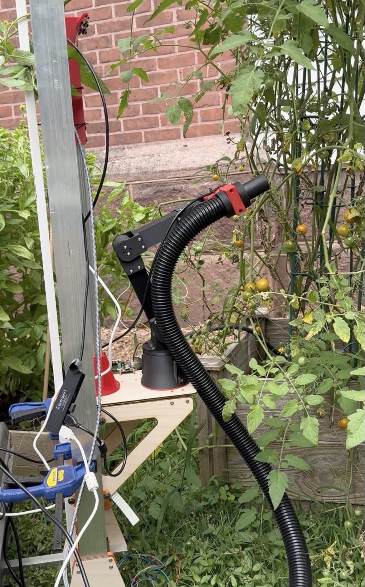
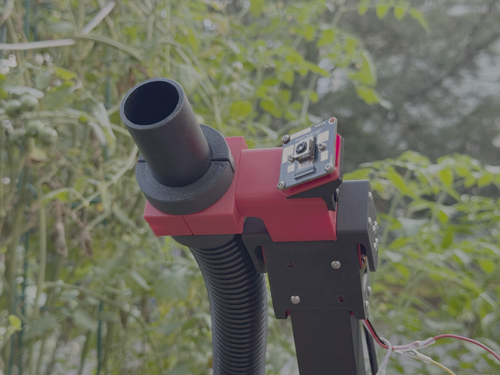

A couple notes:
1. Elevator only moves manually for now because we need to get a new stepper motor driver.
2. Wrist camera is not being used for visual servoing, but it is recording everytime we attempt a harvest for future analysis on how we wanna go about using it.

### Results
Harvesting was much more consistent with the new depth range, and the elevator gave us a lot of flexibility in how we approached each tomato. Raising or lowering the elevator solved two problems at once: tomatoes that used to sit outside the arm's vertical reach came within reach, and tomatoes that fell outside the overhead camera's depth range moved into it.

Some harvesting examples:


### Issues
The main issue we saw was getting enough disparity for tomatoes' ROI. They are so tiny, basically just a spec in the FOV.

### Next Steps
1. A number of minor quality of life changes
2. Integration of wrist camera into pipeline
3. Dynamically zooming into the image for depth estimation.

